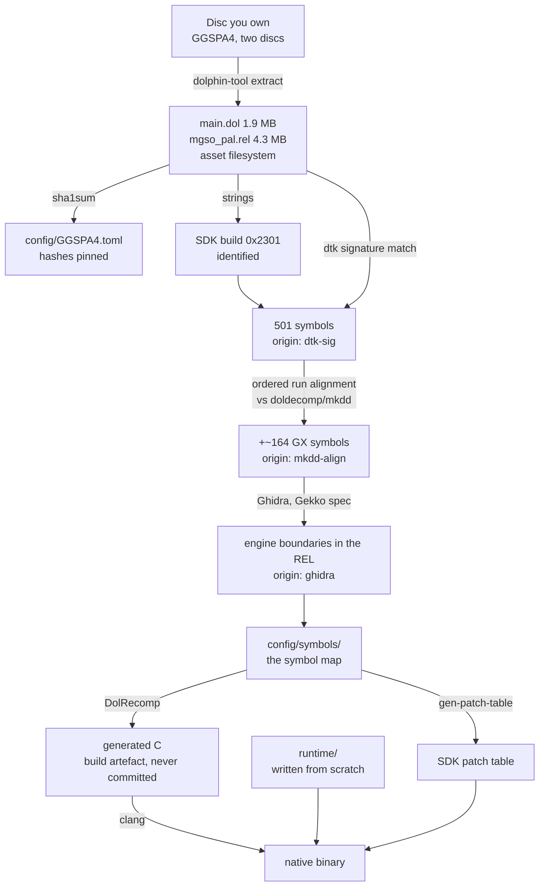

# The decompilation process, end to end

Every stage from a disc you own to a native binary: what goes in, what tool
runs, what comes out, and **how the output is verified**.

This document has two jobs. The first is reproducibility — anyone with the same
disc should reach the same symbol map. The second is **provenance**: `README.md`
claims that everything in this repository was produced by our own analysis of a
legally owned copy, together with public clean-room decompilation projects. This
document is where that claim is made checkable, stage by stage.

**No stage takes input from leaked source code.** Project rule 9 is absolute,
and each stage below names its inputs explicitly so that a reader can confirm
it.

Stages marked **DONE** have been run against the target. Stages marked
**PLANNED** have not; their commands are the intent, not a record.



---

## Stage 1 — Extract the disc · **DONE**

**In:** the user's own disc images. **Out:** `discs/GGSPA4/disc{1,2}/`,
git-ignored.

```sh
tools/dolphin.sh tool extract -i "<disc1>.iso" -o discs/GGSPA4/disc1
tools/dolphin.sh tool extract -i "<disc2>.iso" -o discs/GGSPA4/disc2
```

Produces `sys/main.dol`, `sys/apploader.img`, `sys/fst.bin` and the asset
filesystem including `files/shared/mgso_pal.rel`.

**Verified:** both discs' executables are byte-identical by SHA-1 — `main.dol`,
the REL and the apploader. Only assets differ. The recompiler therefore runs
once, not once per disc.

**Provenance:** the user's own disc. Nothing from this stage is ever committed.

## Stage 2 — Hash and pin · **DONE**

**In:** the extracted executables. **Out:** [`config/GGSPA4.toml`](../config/GGSPA4.toml).

```sh
sha1sum discs/GGSPA4/disc1/sys/main.dol \
        discs/GGSPA4/disc1/files/shared/mgso_pal.rel
```

Hashes are taken of the **extracted executables**, not the disc image. That is
what the build checks, and it makes the check independent of the container
format — `.iso`, `.gcm`, `.rvz` and NKit all produce the same `main.dol`.

**Open:** the current dumps are NKit, so these hashes are not yet confirmed
against a redump-clean image. See HANDOFF F8.

## Stage 3 — Identify the SDK build · **DONE**

**In:** `main.dol`. **Out:** the build ID, recorded in `config/GGSPA4.toml`.

```sh
strings -n 6 discs/GGSPA4/disc1/sys/main.dol | grep "Dolphin SDK"
```

Nintendo's SDK libraries each embed a build string. All thirteen components are
present, newest 2003-08-06, all tagged **`0x2301`**.

**Why this stage exists at all:** the build ID is what makes stage 4 possible.
Without it there is no way to know which other games' decompilations share this
exact SDK, and symbol recovery would be pure manual analysis of 380 KB.

**Provenance:** strings in the user's own binary.

## Stage 4 — Signature-match the SDK · **DONE**

**In:** `main.dol` + `decomp-toolkit`'s signature database.
**Out:** 501 symbols in
[`config/symbols/main.dol.symbols.txt`](../config/symbols/main.dol.symbols.txt),
origin `dtk-sig`.

```sh
extern/decomp-toolkit/target/release/dtk dol info \
    discs/GGSPA4/disc1/sys/main.dol
```

`dtk` compares byte patterns in our binary against signatures derived from
public decompilation projects. A match names the function.

**Recovered:** OS 87, Metrowerks TRK debugger 79, CodeWarrior runtime 78, DVD
21, PPC 20, GX 17, EXI 13, SI 7.

**Provenance:** names come from public clean-room decompilation projects, which
recover the SDK's API by analysing retail binaries. Names, not code.

## Stage 5 — Close the GX gap by run alignment · **PLANNED**

**In:** our function boundaries + `doldecomp/mkdd`'s symbol map.
**Out:** ~164 further GX symbols, origin `mkdd-align`.

Mario Kart Double Dash links **the same SDK `0x2301` build**, and its decomp
publishes a symbol map with addresses and sizes. It names 177 GX functions
against our 17.

**Established before relying on it:** of 287 symbols named in both, **264 have
byte-identical sizes (92%)**. Every mismatch is a C-runtime function whose
codegen varies with compiler options, not an SDK function.

**The method, and why it is not a constant offset.** Each game links only the
SDK functions it references, so the offset between the two binaries is
*piecewise* constant: `GXInit` through `GXSetGPFifo` — five consecutive
functions — all sit at exactly `-0x82098`, then it shifts as functions absent
from one binary drop out. So:

1. Recover complete function boundaries for our `.text`.
2. Walk both lists in address order, anchored on symbols already named in both.
3. Within an aligned run, transfer names by position.
4. **Accept a name only if the size matches**, and record it as `mkdd-align`.

Cross-check names against `extern/dolsdk2004`, which carries 267 GX function
names in source form — the authoritative list of what the GX surface contains.

**Provenance:** a public clean-room decompilation of a different game. No code
is copied; only names, and only where our own binary's function sizes confirm
the match.

## Stage 6 — Recover the engine · **PLANNED**

**In:** `mgso_pal.rel`, 4.3 MB. **Out:** function boundaries, origin `ghidra`.

```sh
tools/ghidra.sh <project-dir> twinsnakes \
    -import discs/GGSPA4/disc1/files/shared/mgso_pal.rel \
    -processor "PowerPC:BE:32:Gekko_Broadway"
```

**Signature matching cannot help here and never will.** The REL is Konami's
MGS2 engine as built for this game: it appears in no other binary, so there are
no signatures to match. `dtk` finds exactly three symbols in it — `_prolog`,
`_epilog`, `_unresolved`. This stage is our own analysis, and it is the bulk of
phase 0.

Use `PowerPC:BE:32:Gekko_Broadway`, not `PowerPC:BE:32:default` — the stock
variant mis-decodes the paired-single instructions.

Anchors that make the work tractable: `OSReport` format strings name their own
functions, every SDK call site named in stage 4 or 5 labels its caller, and the
engine leaves source filenames in the binary (`libgv_cnf.c`, `brk_potato.c`,
`gcn_dgd.c`).

**Provenance:** our own analysis, in Ghidra, of the user's own binary.

## Stage 7 — Translate to C · **PLANNED**

**In:** `main.dol`, `mgso_pal.rel`, the symbol map. **Out:** `build/generated/`,
git-ignored.

```sh
cmake --build build    # runs DolRecomp as a build step
```

DolRecomp translates each function to `void fn_80xxxxxx(PPCContext*, uint8_t*)`.
SDK symbols are **not** translated: they are routed to the patch table and
replaced by the native runtime.

The generated C is a **build artefact**. It is never hand-edited and never
committed — it is regenerated from the user's own disc on every build, which is
also why no game code enters this repository.

## Stage 8 — Compile and link · **PLANNED**

**In:** generated C + `runtime/` + `patches/`. **Out:** the native binary.

The runtime is **written from scratch** for this project. Where it reuses code,
that code is from Dolphin under GPL, recorded in `THIRD_PARTY.md` with its
source commit — which is why the port is GPL-3.

Compile with `-O2`, not `-O3`, and **never `-ffast-math`**: paired-single
semantics need exact rounding.

## Stage 9 — Verify against the original · **PLANNED**

**In:** the port and Dolphin. **Out:** a divergence report.

Because the game's logic is unchanged, any divergence from Dolphin localises to
a shim rather than to the game. Record an input sequence in Dolphin, replay it
in the port, and compare guest-memory checksums at fixed frames; diff `OSReport`
output between the two.

This harness is built in phase 1 and used for the rest of the project.

---

## Provenance ledger

Every symbol in `config/symbols/` carries an origin column. The permitted values
are exactly:

| Origin | Meaning |
|---|---|
| `dtk-sig` | signature match against the SDK `0x2301` build |
| `mkdd-align` | ordered run alignment against `doldecomp/mkdd` |
| `sdk2004` | name confirmed against `doldecomp/dolsdk2004` sources |
| `ghidra` | recovered by our own analysis |
| `own` | named by our own reasoning about behaviour |

**There is no origin for leaked source, and there will not be one.** If a symbol
cannot be given one of the origins above, it does not go in the map.
