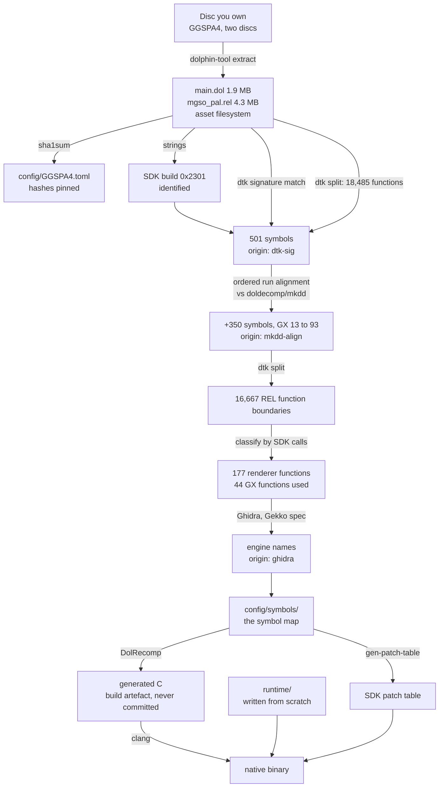

# The decompilation process, end to end

Every stage from a disc you own to a native binary: what goes in, what tool
runs, what comes out, and **how the output is verified**.

This document has two jobs. The first is reproducibility — anyone with the same
disc should reach the same symbol map. The second is **provenance**: `README.md`
claims that everything in this repository was produced by our own analysis of a
legally owned copy, together with public clean-room decompilation projects. This
document is where that claim is made checkable, stage by stage.

**No stage takes input from leaked source code.** Project rule 9 is absolute,
and each stage below names its inputs explicitly so that a reader can confirm
it.

Stages marked **DONE** have been run against the target. Stages marked
**PLANNED** have not; their commands are the intent, not a record.



---

## Stage 1 — Extract the disc · **DONE**

**In:** my own disc images. **Out:** `discs/GGSPA4/disc{1,2}/`,
git-ignored.

```sh
tools/dolphin.sh tool extract -i "<disc1>.iso" -o discs/GGSPA4/disc1
tools/dolphin.sh tool extract -i "<disc2>.iso" -o discs/GGSPA4/disc2
```

Produces `sys/main.dol`, `sys/apploader.img`, `sys/fst.bin` and the asset
filesystem including `files/shared/mgso_pal.rel`.

**Verified:** both discs' executables are byte-identical by SHA-1 — `main.dol`,
the REL and the apploader. Only assets differ. The recompiler therefore runs
once, not once per disc.

**Provenance:** my own disc. Nothing from this stage is ever committed.

## Stage 2 — Hash and pin · **DONE**

**In:** the extracted executables. **Out:** [`config/GGSPA4.toml`](../config/GGSPA4.toml).

```sh
sha1sum discs/GGSPA4/disc1/sys/main.dol \
        discs/GGSPA4/disc1/files/shared/mgso_pal.rel
```

Hashes are taken of the **extracted executables**, not the disc image. That is
what the build checks, and it makes the check independent of the container
format — `.iso`, `.gcm`, `.rvz` and NKit all produce the same `main.dol`.

**Open:** the current dumps are NKit, so these hashes are not yet confirmed
against a redump-clean image. See HANDOFF F8.

## Stage 3 — Identify the SDK build · **DONE**

**In:** `main.dol`. **Out:** the build ID, recorded in `config/GGSPA4.toml`.

```sh
strings -n 6 discs/GGSPA4/disc1/sys/main.dol | grep "Dolphin SDK"
```

Nintendo's SDK libraries each embed a build string. All thirteen components are
present, newest 2003-08-06, all tagged **`0x2301`**.

**Why this stage exists at all:** the build ID is what makes stage 4 possible.
Without it there is no way to know which other games' decompilations share this
exact SDK, and symbol recovery would be pure manual analysis of 380 KB.

**Provenance:** strings in my own binary.

## Stage 4 — Signature-match the SDK · **DONE**

**In:** `main.dol` + `decomp-toolkit`'s signature database.
**Out:** 501 symbols in
[`config/symbols/main.dol.symbols.txt`](../config/symbols/main.dol.symbols.txt),
origin `dtk-sig`.

```sh
extern/decomp-toolkit/target/release/dtk dol info \
    discs/GGSPA4/disc1/sys/main.dol
```

`dtk` compares byte patterns in our binary against signatures derived from
public decompilation projects. A match names the function.

**Recovered:** OS 87, Metrowerks TRK debugger 79, CodeWarrior runtime 78, DVD
21, PPC 20, GX 17, EXI 13, SI 7.

**Provenance:** names come from public clean-room decompilation projects, which
recover the SDK's API by analysing retail binaries. Names, not code.

## Stage 5 — Close the GX gap by run alignment · **DONE**

**In:** our function boundaries + `doldecomp/mkdd`'s symbol map.
**Out:** 350 further symbols, origin `mkdd-align`.

Mario Kart Double Dash links **the same SDK `0x2301` build**, and its decomp
publishes a symbol map with addresses and sizes.

**Established before relying on it:** of 287 symbols named in both, **264 have
byte-identical sizes (92%)**. Every mismatch is a C-runtime function whose
codegen varies with compiler options, not an SDK function.

**Why it is not a constant offset.** Each game links only the SDK functions it
references, so the offset is *piecewise* constant: `GXInit` through
`GXSetGPFifo` — five consecutive functions — all sit at exactly `-0x82098`,
then it shifts as functions absent from one binary drop out.

```sh
tools/align-symbols.py \
    --ours build/phase0/main.symbols.txt \
    --ref  extern/mkdd/config/MarioClub_us/symbols.txt \
    --out  build/phase0/aligned.txt
```

The tool runs two independent passes, and a name is only ever written onto an
unnamed `fn_*` function whose size matches exactly:

1. **Between-anchor segments.** Two consecutive anchors bracket a segment in
   each binary. If the segments are the same length *and* every size agrees
   pairwise, the linker kept the same functions in the same order between those
   points, and the mapping is 1:1.
2. **Gap resync.** A run ends at a size mismatch because one binary links a
   function the other does not. Rather than stopping, look ahead a bounded
   distance in each list for a point where the next **3 consecutive sizes all
   agree**, and resume there. The window guard is what makes this safe: a lone
   size coincidence is common — many functions are 0x20 bytes — but three in a
   row agreeing by chance is not.
3. **Run extension.** Walk outward from each anchor while sizes agree. This
   catches the regions beyond the first and last anchor.

A function claimed with two different names by different runs is dropped
rather than guessed at.

### Result, and the proof of it

```
ours              1804 functions in .text
reference        15342 functions in .text
anchors            264 (same name AND same size in both)
segments mapped     59 (consecutive anchors, exact size agreement)
gap resyncs       1275 (3 consecutive sizes must agree)
runs extended      479
names assigned     415
```

| | before | after |
|---|---|---|
| symbols in the map | 501 | **915** |
| GX functions named | 13 | **148** |
| SDK entry points the engine calls, named | 70 | **96** |

**Three independent checks, all passed:**

1. **The two passes agree.** Segment matching produced **no names that run
   extension had not already produced, and no contradictions**. Two different
   methods over the same data reaching the same answer is the strongest signal
   available here.
2. **Sizes match exactly**, by construction — a name is never transferred onto
   a function of a different size.
3. **Cross-checked against a second, unrelated source.** Of the 131 GX names
   this stage produced, **111 (85%) appear in `doldecomp/dolsdk2004`'s GX
   sources**, a decompilation of a *different* SDK release by a *different*
   project. Those that do not are internal `__GX*` statics, where decomp
   projects legitimately differ on naming — no public API function is
   unaccounted for.
4. **Gap resync raised precision rather than trading it away.** Before resync,
   82% of GX names were confirmed by `dolsdk2004`; after, **85%**. It also
   changed **no** previously-assigned name. A relaxation that increases
   agreement with an independent source is doing real work, not guessing.

**Remaining:** MKDD names 177 GX functions; we have 93. The rest were not
recovered because the surrounding runs broke on size disagreement, which
happens wherever the two games link different neighbouring functions. Closing
that needs the Dolphin SDK-call log (stage 9's harness, built early) or manual
analysis in Ghidra.

**Provenance:** a public clean-room decompilation of a different game. No code
is copied — only names, and only where our own binary's function sizes
independently confirm the match. `tools/align-symbols.py` is our own code and
is committed, so the derivation can be re-run and checked.

## Stage 5b — Match inline-assembly bodies · **DONE**

*(Second pass, 2026-09-19 — the first pass read a quarter of the available
assembly. See below.)*

**In:** our disassembly + `doldecomp/dolsdk2004` sources.
**Out:** 3 symbols, origin `sdk2004-asm`.

Parts of the SDK — the paired-single maths especially — are written as **inline
assembly** rather than C. That makes them the strongest signature available:
the compiler emits those instructions verbatim, so the machine code is identical
across SDK revisions, link orders and games. Unlike stage 5, this needs no
anchors and no assumptions about what either binary links.

```sh
tools/match-sdk-asm.py \
    --sdk extern/dolsdk2004/src/mtx/*.c \
          extern/dolsdk2004/src/gx/GXTransform.c \
          extern/dolsdk2004/src/gx/GXLight.c \
          extern/dolsdk2004/src/base/PPCArch.c \
    --asm build/phase0/out/asm/auto_01_800055E0_text.s
```

A match requires the **full opcode sequence, in order, same length**. A prefix
match is not a match.

```
SDK inline-asm signatures     31
our functions               1806
exact full-sequence matches    3
ambiguous signature (skip)     2
non-unique body (refused)      4
```

**The refusals are the important part.** Four of our functions matched, but in
pairs: two matched `PSQUATAdd`, two matched `PSQUATSubtract`. A 4-float add is a
4-float add — the SDK contains distinct functions with identical instruction
sequences, so matching one name to two addresses proves the sequence does *not*
identify the function. The tool refuses both rather than pick one.

Those four are the *hottest* unnamed functions in the binary — `0x80025800`
alone has **913 call sites**. Naming them on a 50/50 guess would have been the
single most damaging error available. They stay unnamed until something
disambiguates them.

Accepted, each verified instruction-for-instruction against the SDK source:
`PSVECSquareMag`, `PSQUATDotProduct`, `PSVECSquareDistance`.

**Provenance:** the name comes from a public clean-room decompilation; the
confirmation that it belongs at that address comes from our own binary.

## Stage 5c — Attribute by library locality · **DONE (limited result)**

**In:** the symbol map + the engine's call sites. **Out:** a library for 40 of
the 237 unnamed SDK entry points. **Assigns no names.**

SDK libraries link contiguously, so an unnamed function surrounded by named
functions of one library is probably in it.

```sh
tools/attribute-library.py --symbols config/symbols/main.dol.symbols.txt \
    --asm build/phase0/out/mgso_pal/asm/auto_00_00000000_text.s
```

```
SDK entry points the engine calls, unnamed     237
  attributed to a library                       40  (17%)
  on a library boundary (left alone)           197

library    functions  call sites
GX                29         199
OS                 7          13
PS                 2          32
VI                 1           2
DVD                1           1
```

**The useful part: 29 unnamed GX functions carrying 199 call sites.** Those are
renderer entry points the engine demonstrably uses, and phase 3 has to
implement them whatever they turn out to be called.

**The honest part: 17% is this technique's ceiling, and it is recorded so it is
not retried.** Two things defeat it, and neither is fixable by tuning:

- **Libraries genuinely interleave.** `SI` sits entirely inside `OS`'s address
  span. Only `TRK`, `EXI` and `SI` have ranges that overlap nothing, and those
  are the libraries we care least about.
- **Naming density is too low.** With 40% of the DOL named, consecutive named
  functions frequently belong to different libraries, so the bracket test
  refuses — 197 of 237 landed on an apparent boundary.

Two fixes were tried and are worth not repeating: separating `DBG`/`EXI2_` from
`DB`/`EXI` (they are the debugger mailbox library and live 190 KB away), and
trimming range outliers so one misfiled symbol could not stretch a range across
the binary — `__DBVECTOR` alone was swallowing DVD, VI and GX. Both were
necessary and neither was sufficient.

**The remaining 237 need dynamic information.** A Dolphin SDK-call log gives
each entry point a name from the call itself rather than from its neighbours,
and it is required for phase 2 regardless.

## How complete is this?

"Percent decompiled" has no single honest answer for a recompilation, because
we are not producing matching source. Four different numbers, and the last one
is the one that governs the work:

| Measure | | |
|---|---|---|
| **1. Functions named** | 1,006 / 18,485 | **5.4%** |
| — `main.dol` | 997 / 1,818 | 54.8% |
| — `mgso_pal.rel` | 9 / 16,667 | 0.1% |
| **2. Function boundaries recovered** | 18,485 / 18,485 | **100%** |
| **3. SDK entry points the engine calls, named** | 198 / 336 | **58.9%** |
| — weighted by call sites | 6,144 / 7,078 | **86.8%** |
| **4. GX surface the game uses, named** | 81 / 81 | **100.0%** |

**Why 5.4% is the least useful number here.** The engine is translated
mechanically — DolRecomp does not care what a function is called. Names in the
REL buy debugging and hand-written patches, not correctness, which is why 0.1%
there is not a blocker. What the runtime must replace is the **SDK boundary**,
and that is measure 3.

**Measure 2 is the one that unblocks the build.** The recompiler consumes
function boundaries, and those are complete for both modules.

**Measure 3 is the one that is nearly done, and it is not the same as measure
1.** Weighted by call sites it stands at 86.8%, well ahead of the 58.9% count
of entry points, and the gap between those two is the point: what remains
unnamed is mostly called once or twice, while everything the engine leans on
heavily is known. The 138 entry points still unnamed are the tail.

**Where measure 1 stops improving.** 934 unnamed call sites remain and only 52
of them — 6% — sit in code with any public reference to match against. The rest
is Konami's own sound, Tremor and CR_System code, for which no decompilation
exists to align with. Signature matching and source-order alignment are close
to exhausted there; what is left needs a function read at a time in Ghidra,
which is in scope but buys debugging rather than correctness.

## Stage 5b, second pass — all of the SDK's assembly · **DONE**

**In:** our disassembly + `doldecomp/dolsdk2004`. **Out:** 12 matches, 3 new.

```sh
python3 tools/match-sdk-asm.py --sdk extern/dolsdk2004/src/*/*.c \
    --asm build/phase0/out/asm/auto_01_800055E0_text.s \
    --boundaries build/phase0/main.symbols.txt --out asmmatch.txt
```

The first pass handled `void f() { asm { ... } }` and found **33** signatures.
The decomp writes nearly all of its assembly as `asm void PSVECAdd(...) { }` —
the whole function — and there are **146**. Both forms gives **113** usable.

**Offsets cannot be compared across the two sides.** The decomp writes them
symbolically (`psq_l f2, Vec.x(a), 0, 0`); our disassembly has the resolved
numbers. Including them made every signature fail — the first attempt after
widening the parser produced **zero** matches.

**The quantised W bit replaces them and carries the distinction they were for.**
`psq_l` with W=0 moves a pair, W=1 moves one. A three-component vector loads
2+1; a four-component quaternion loads 2+2. Their mnemonic sequences are
otherwise identical, so without W the matcher refuses both as non-unique and
with mnemonics alone it names one of them wrong.

| | |
|---|---|
| exact full-sequence matches | 12 |
| already named — independent confirmation | 9 |
| **new** | **3** |

The three are `PSQUATAdd`, `PSQUATSubtract`, `PSQUATScale` — at 913, 697 and
687 call sites, the three most-called unnamed functions in the binary.

| measure | before | after |
|---|---|---|
| SDK call sites covered | 2,764 / 7,078 (39.1%) | **5,061 / 7,078 (71.5%)** |
| phase 0 average | 57.9% | **64.6%** |

**Three names moved call-site coverage by 32 points.** Counting *functions*
named treats a leaf called 900 times the same as one called once; the
call-site measure is the one that says what the engine actually depends on.

## Stage 5b, third pass — two bugs that cost 22 matches · **DONE**

**In:** our disassembly + `doldecomp/dolsdk2004`. **Out:** 34 matches, 5 new,
and one name already in the map corrected.

```sh
python3 tools/match-sdk-asm.py --sdk $(find extern/dolsdk2004/src -name '*.c') \
    --asm build/phase0/out/asm/auto_01_800055E0_text.s \
    --boundaries build/phase0/main.symbols.txt --out asmhits.txt
```

The second pass reported 12 matches and was believed to have exhausted the
method. It had not. `PSMTX44Concat` is **byte-for-byte identical** to our
`fn_800250CC` — all 65 instructions, in order — and did not match. Two
defects, each of which silently subtracted from the count rather than
reporting anything:

**`nofralloc` is a directive, not an instruction.** It tells the Metrowerks
compiler not to build a stack frame and emits no code. It appeared in the SDK
side of every signature that used it and could never appear in ours, and
since a match is accepted only on the *full* sequence, every such function
failed by exactly one token.

**The trailing `blr` was stripped from one side only.** Our disassembly always
carries the return; the SDK writes it explicitly in some asm bodies and lets
the compiler add it in others. Stripping it from our side and not theirs made
every explicitly-returning function differ by one token — again, by exactly
one, and again with no diagnostic.

Both are now filtered symmetrically in `opcodes()`/`load_sdk()`.

| | |
|---|---|
| SDK inline-asm signatures | 104 |
| exact full-sequence matches | 34 |
| already named — independent confirmation | 19 |
| **new** | **5** |
| ambiguous signature (refused) | 5 |
| non-unique body (refused) | 2 |

The five new are `OSSwitchFiber`, `PSMTXMultVec`, `PSMTX44Copy`,
`PSMTX44Concat` and `PSMTX44Transpose`. The last three are called **164, 104
and 39** times by the engine; `PSMTXMultVec` 17 times.

**Nineteen already-named functions reproducing themselves is the cross-check.**
`DCFlushRange`, `ICInvalidateRange`, `PPCHalt`, `PSVECAdd` and fifteen others
were named by ordered run alignment, by an unrelated route, and the
instruction-sequence match arrives at the same name at the same address.

### Fourth pass: operand shape, and the prologue a C wrapper emits

Two more gaps, found by identifying `PSMTX44Identity` by hand and then asking
why the matcher had not.

**The mnemonics do not always separate two functions.** `PSMTX44Identity` and
`PSMTX44Scale` emit the same ten instructions in the same order - four stores
on a 4x4 matrix's diagonal with paired-single zeroes between - and the matcher
correctly refused both. What separates them is *which* operand is which:
Identity stores one constant on all four diagonal positions, Scale stores
three arguments and then a constant. `reg_shape()` replaces every operand by
the order it was first seen, which makes the SDK's symbolic names (`c1`, `m`,
`xS`) comparable with our register numbers:

```
PSMTX44Identity   0.1  2.1  2.1  0.1  2.1  2.1  0.1  2.1  2.1  0.1
PSMTX44Scale      0.1  2.1  2.1  3.1  2.1  2.1  4.1  2.1  2.1  5.1
```

It is used only to break a tie the mnemonics leave, never to make a match on
its own.

**A C function wrapping an `asm` block has a prologue.** The declarations that
feed the block - `register f32 c1 = 1.0f;` - become loads the compiler emits
*before* it, and those are not in the SDK's signature because they are not in
the block. So our function is the SDK's sequence with a few instructions in
front. Up to four leading instructions may be skipped, **only if they are all
loads, and only if the operand shape matches on the suffix**. That last
condition is what makes it safe: skipping instructions until something matches
would find a match for almost anything.

Two smaller alignments were needed before either worked: our disassembly
writes the quantisation register as `qr0` where the SDK writes a bare `0`, and
the trailing `blr` had to be dropped from the shape as it already was from the
opcode sequence.

| | |
|---|---|
| exact full-sequence matches | 34 -> **38** |
| separated by operand shape | 4 |
| ambiguous (refused) | 7 |

**No new names.** All four shape-separated functions were already in the map,
and the pass agreed with every one of the 29 names it could check. Its value
is that it reproduced, from the binary alone, a name that had been derived by
hand - and that the next `PSMTX44Identity` will not need deriving by hand.

### A name in the map was wrong, and this is what found it

`0x8001D124` was recorded as `DCZeroRange`, origin `mkdd-align`. Its body is:

```
cmplwi r4, 0x0 ; blelr ; clrlwi r5, r3, 27 ; add r4, r4, r5
addi r4, r4, 0x1f ; srwi r4, r4, 5 ; mtctr r4
.L: dcbst r0, r3 ; addi r3, r3, 0x20 ; bdnz .L ; blr
```

`dcbst` is *store*. `DCZeroRange` is `dcbz`. The function is
**`DCStoreRangeNoSync`**, which is what the assembly match says, and two
independent routes agree:

- the SDK's `OSCache.c` order is `DCFlushRangeNoSync`, `DCStoreRangeNoSync`,
  `DCZeroRange`, `DCTouchRange`, `ICInvalidateRange`. Our binary has exactly
  **one** function between `DCFlushRangeNoSync` and `ICInvalidateRange`;
- there is **no `dcbz` anywhere in `main.dol`** outside `__LCEnable`'s
  `dcbz_l`. `DCZeroRange` and `DCTouchRange` were dead-stripped.

Ordered alignment mis-assigned it because it assumed both survived the link.
**This is the failure mode the origin column exists for:** a name carrying
`mkdd-align` is a name resting on an assumption about what the *other* binary
contains, and it is worth re-checking against evidence taken from ours.

### Where the call graph stops

Of the 172 SDK entry points still unnamed when this was measured: 43 have a
named callee, 14 a named caller, 52 either — and **50 have no calls and no
callers at all**. Stage 5d has a hard ceiling and has reached it. A leaf is
named by its instruction sequence (this stage) or by a string it references
(stage 5e), and those are the two with room left.

## Stage 5g — Name from a function's own diagnostic message · **DONE**

**In:** `main.dol` + our disassembly. **Out:** 1 name.

```sh
python3 tools/name-by-messages.py --image discs/GGSPA4/disc1/sys/main.dol \
    --asm build/phase0/out/asm/*text*.s \
    --symbols config/symbols/main.dol.symbols.txt \
    --boundaries build/phase0/main.symbols.txt \
    --sdk-src extern/dolsdk2004/src extern/tremor extern/ogg/src
```

The SDK's error paths say who they are, and this build kept 15 of them:

```
"VIConfigure(): Tried to change mode from (%d) to (%d), which is forbidden"
"OSCheckHeap: Failed 0 <= heap && heap < NumHeaps in %d"
"__DSP_boot_task()  : IRAM MMEM ADDR: 0x%08X"
```

Two checks: the name must exist in the SDK decomp — which distinguishes a real
symbol from prose that parses as an identifier — and exactly one function may
reference the string, because a message referenced twice is evidence about
neither.

| | |
|---|---|
| messages opening with a known SDK name | 15 |
| referenced from exactly one function | 1 |
| **named** | **1** — `OSCheckHeap` at `0x8001CC74` |

A small yield kept for two reasons: it costs nothing to re-run as the map
grows, and the one it found is in the path currently blocking the boot —
`OSCheckHeap` is what the allocator calls when a MUST_SUCCEED allocation fails.

**Nothing on the REL.** Its strings are asset names, not diagnostics.

## Stage 5d — Name by call graph · **DONE**

**In:** our disassembly + `doldecomp/dolsdk2004`. **Out:** 24 names.

Stage 5 is exhausted: three independent reference decomps now agree on 567
names and, run together, add **nothing** beyond what the map already holds.

| reference | functions | anchors | names |
|---|---|---|---|
| `mkdd` | 15,342 | 264 | 415 |
| `ref-ttyd` | 6,975 | 273 | 496 |
| `ref-pikmin2` | 24,942 | 280 | 436 |
| **consensus (2+ agree)** | | | **445** |
| **new** | | | **0** |

What alignment cannot do is name a function the reference games never linked.
A function's CALLEES can:

```sh
python3 tools/match-callgraph.py --asm build/phase0/out/asm/*text*.s \
    --symbols config/symbols/main.dol.symbols.txt \
    --boundaries build/phase0/main.symbols.txt \
    --sdk-src extern/dolsdk2004/src extern/tremor extern/ogg/src \
    --file-map build/phase0/files.txt --out callgraph.txt
```

Shared callees are weighted by rarity — a shared call to something 200
functions use is nearly free; one that two use is decisive. **Ambiguity is
refused**, not resolved by preference, and **a name claimed by two addresses
withdraws both**: at most one can be right and nothing says which.

**Checked by a second, independent route.** The linker lays an object's
functions down together, so a correct name should sit among neighbours from
its own SDK module. Of 27 candidates, 22 agreed and **5 were withdrawn**.

| round | proposed | confirmed | withdrawn |
|---|---|---|---|
| 1 | 27 | 22 | 5 |
| 2 | 6 | 2 | 4 |
| 3 | 4 | 0 | 4 |
| **total** | | **24** | |

It iterates because each confirmed name is evidence next round. It stops when
a round confirms nothing.

## Stage 5e — Attribute functions to their source file · **DONE**

**In:** `main.dol` + our disassembly. **Out:** 72 functions placed in a file.

Shipped C carries its own source file name. This binary hands `__FILE__` to a
tracking allocator:

```
addi r5, lbl_80063B08@l   ; "framing.c"
li   r6, 0x360            ; 864   <- __LINE__
bl   fn_80055B74          ; the allocator
```

```sh
python3 tools/attribute-by-strings.py --dol discs/GGSPA4/disc1/sys/main.dol \
    --asm build/phase0/out/asm/*text*.s \
    --symbols config/symbols/main.dol.symbols.txt --out files.txt
```

**21 source file names, 72 functions attributed, 0 ambiguous.** And a finding
that mattered more than the count: `res012.c`, `floor0.c`, `sharedbook.c`,
`framing.c` — **this game embeds Tremor**, Xiph's fixed-point Vorbis decoder.
`res012.c` is decisive; stock libvorbis renamed that file years earlier.

## Stage 5e-REL — Attribute the engine to its source files · **DONE**

**In:** `mgso_pal.rel` + its disassembly. **Out:** 10 functions placed, and
the boot blocker located.

```sh
python3 tools/attribute-by-strings.py --rel \
    --dol discs/GGSPA4/disc1/files/shared/mgso_pal.rel \
    --asm build/phase0/out/mgso_pal/asm/*.s \
    --symbols config/symbols/main.dol.symbols.txt \
    --out config/symbols/mgso_pal.rel.files.txt
```

A REL is relocatable and **every section is based at zero**, so an address
alone is not a location — `.text+0x1000` and `.data+0x1000` are different
places. dtk's labels say which (`lbl_1_data_D5F8`), and the section names are
read from the disassembler's own output **matched by size**, not by ordinal:
this REL has two four-byte sections before `.rodata`, and an ordinal rule puts
every later section one or two names out.

| file | functions |
|---|---|
| `gcn_dgd.c` | 4 |
| `gcn_spheremap.c` | 2 |
| `memory.c`, `libgv_cnf.c`, `GCN_prim2.c`, `mpegGCN.c` | 1 each |

These are **attributions, not names**. The engine is Konami's own code and no
public decompilation of it exists, so the file is recoverable and the name is
not — which is still the difference between `fn_1_F4DCC` and "the allocator
wrapper in memory.c".

### Checked against the running game

The port panics at `"memory.c" on line 1197`. Two independent routes agree on
which function that is:

| route | evidence |
|---|---|
| runtime | the panic's stack dump gives return address `0x7F0FCF00`, so its caller starts at `0x7F0FCEB8` |
| static | REL offset `0x0F4DCC` holds a pointer to `"memory.c"` and the immediate `0x4AD` = 1197; it loads at **`0x7F0FCEB8`** |

That also settles a phase-0 open question: `mpegGCN.c` is in the REL, so the
MPEG video decoder is the game's own code and not an SDK component (F10).

## Stage 5e-DOL — Attribute main.dol to its source files · **DONE**

**In:** `main.dol` strings + our disassembly. **Out:** 64 attributions, and
the identification of 198 previously unattributed functions.

Stage 5e was run on the engine overlay. It had never been run on `main.dol`,
on the assumption that `main.dol` is SDK, CodeWarrior runtime and the
Metrowerks TRK debugger. **That assumption was wrong**, and the strings say
so:

```sh
# every printable run in the DOL's loaded segments, with its guest address
python3 - <<'EOF'
import struct, re
d = open('discs/GGSPA4/disc1/sys/main.dol','rb').read()
offs, addrs, sizes = (struct.unpack('>18I', d[i:i+72]) for i in (0,72,144))
for a,o,s in ((addrs[i],offs[i],sizes[i]) for i in range(18) if sizes[i]):
    for m in re.finditer(rb'[\x20-\x7e]{6,}\x00', d[o:o+s]):
        print(hex(a+m.start()), m.group(0)[:-1].decode())
EOF
```

Nineteen of them are `__FILE__` strings, and they name Konami's own sound
layer — `sd_sound.c`, `sd_stream2.c`, `sd_mem.c`, `sd_ogg.c` — and a complete
**Tremor**, the Xiph fixed-point Vorbis decoder: `codebook.c`, `floor0.c`,
`floor1.c`, `framing.c`, `info.c`, `mapping0.c`, `res012.c`, `sharedbook.c`,
`vorbisfile.c`, `block.c`. Plus `rel_loader.c`, `texPalette.c`, `CR_System.c`,
`dvdfs.c` and `skstuff.c`.

That block is `0x8004E700`–`0x80062000`: **198 functions, about 34 KB, every
one of them unnamed**, and it is what the engine's audio reaches.

### Reading the file and the line out of the instruction stream

The `__FILE__` string alone says which functions mention a file. The **line**
comes from the same call: Konami replaced the allocators with tracked ones
that take `(…, file, line, …)`. Tracking registers to each `bl` gives the ABI
without assuming it:

| callee | file in | sites |
|---|---|---|
| `fn_80055C9C` | r4 | 54 |
| `fn_80055B74` | r5 | 30 |
| `fn_80055B08` | r4 | 24 |
| `fn_80055BCC` | r5 | 4 |

— and all four are inside `sd_mem.c`'s own address range, which is the check
that they are what they look like. The line is the next register.

### The cross-check, and it is a strong one

Within every one of the **nine** Tremor/ogg translation units the line
numbers run **strictly downwards** as the address rises — CodeWarrior emitted
those units in reverse order of definition — while the **four** Konami
`sd_*.c` units run strictly upwards. Thirteen files monotonic, nine one way
and four the other, is not something a mis-parse produces.

A second check: every file's attributed functions form a **contiguous,
non-overlapping** address run, and the runs are in link order. Had the
register tracking been picking up the wrong constant, the runs would
interleave.

### What this does NOT give, and why it is not claimed

The line numbers **do not match upstream Tremor**. `framing.c` line 864 is
inside `ogg_stream_pagein` upstream; here it allocates 80 bytes. Konami edited
these files — replacing Xiph's allocator with their own is one visible change
among others — so upstream line numbers cannot be used to put *names* to
these addresses, and **none are claimed**. Aligning by ordinal within a file
would produce names with no valid origin, which is exactly what stage 5's
rules refuse.

The result is in `config/symbols/main.dol.files.txt`: **64 attributions**, of
which 31 are functions already named, which is itself corroboration — the
attribution agrees with the name in every case.

## Stage 5f — Name by exact source line · **DONE**

**In:** stage 5e's file and line pairs. **Out:** 29 names.

The line number is a plain `li` in the instruction stream, so a function does
not merely belong to `framing.c` — it contains the allocation at
`framing.c:864`, and exactly one function does.

```sh
python3 tools/match-source-order.py --file-map files.txt \
    --boundaries build/phase0/main.symbols.txt \
    --symbols config/symbols/main.dol.symbols.txt \
    --src extern/tremor extern/ogg/src extern/dolsdk2004/src
```

**A wrong assumption, corrected by the data.** This was written first to
require address order to follow source order, because a compiler emits
functions in source order. The data refused it: `floor0.c`'s *highest*
address holds the allocation at line 302, which is the file's *third*
function. Metrowerks reordered them. The ordering constraint was removed —
it would have rejected two names that a single exact line establishes alone.

What is required instead: the line must land in **exactly one** function, and
no two addresses may claim the same one. Ambiguous addresses are skipped.

### Result

| | |
|---|---|
| stage 5d, call graph | 24 |
| stage 5f, file and line | 29 |
| **agreed by both routes** | **1** (`vorbis_book_init_decode`) |
| **added to `config/symbols/`** | **52** |

Each carries its origin — `callgraph`, `fileline`, or `callgraph+fileline`
where both routes agree — so any one can be re-derived or withdrawn on its
own (rule 15).

| measure | before | after |
|---|---|---|
| Functions named | 868 | **920** |
| SDK entry points the engine calls, named | 151 / 336 | **160 / 336** |
| SDK call sites covered | 2,725 | **2,755** |
| GX surface named | 168 / 177 | **171 / 177** |
| **phase 0 average** | 56.6% | **57.6%** |

## Stage 5h — Name from the shadow, not from the shape · **DONE**

**In:** the 1,161 unnamed call sites left after stage 5f. **Out:** 21 symbols
(18 functions, 3 objects), covering 220 call sites.

### First, where the work actually is

"1,161 call sites unnamed" invites the wrong work, because it does not say
whether anything exists to match them against. Sorting them by region does:

```sh
python3 tools/unnamed-by-region.py
```

| region | call sites | public reference? |
|---|---|---|
| Konami sound / Tremor | 602 | no |
| CR_System (Konami) | 270 | no |
| CodeWarrior runtime / boot | 184 | partly |
| SDK: GX | 55 | yes |
| SDK: OS | 26 | yes |
| SDK: audio / DSP / AR / CARD | 24 | yes |

**872 of 1,161 are in Konami's own code**, where no reference binary exists to
align against and no upstream source exists to match. Every name there must be
earned one function at a time and can only ever be a description. The work
that could move was the other quarter, and that is what this stage took.

The region table in that tool is coarse and two of its boundaries are
evidenced rather than assumed: `0x80046EF0` is where
`config/symbols/main.dol.files.txt` places `texPalette.c`, and an earlier
version of the table that ran "SDK: GX" to `0x8004A000` duly reported
`fn_8004701C` as a matchable SDK function when it is Konami's. The tool now
says where its own boundaries came from, and defers to `main.dol.files.txt`.

### Then, the route: start from the data, not the function

The productive move in this stage was not matching function bodies. It was
identifying **a register shadow, a struct offset or a constant pool**, and
letting that name several functions at once — with each one checkable field
by field rather than as a whole-body resemblance.

**`__GXData+0x1DC` is PE_CONTROL.** Not inferred from neighbours: `GXInit`
writes the register index into the word's top byte, in the clear.

```sh
awk '/0x8003F3E8/,/0x8003F424/' build/phase0/out/asm/auto_01_800055E0_text.s
# li r0, 0x43  ...  rlwimi r5, r0, 24, 0, 7  /  stw r5, 0x1dc(r8)
```

BP 0x43 is PE_CONTROL, whose value bits 0-2 are the pixel format, 3-5 the
z format and 6 the early-z test. That one fact named `GXPixModeSync`
(re-sends the whole word, no argument) and confirmed the neighbouring
`GXSetPixelFmt` and `GXSetZCompLoc` — which were carrying `mkdd-align`, an
*ordering* argument, and now have a behavioural one too.

**`__GXData+0x204` is genMode**, pinned the same way by the already-named
`GXSetCullMode` writing bits 16-17 of it. `GXGetCullMode` follows: adjacent,
the same 0x44 bytes, and applying the identical 1 <-> 2 remap in reverse
because the hardware's cull field has FRONT and BACK swapped relative to the
API enum.

**`CARDStat`'s offsets** named the memory-card module. `CARDGetStatus` matches
`CARDStat.c` instruction for instruction — bound `CARD_MAX_FILE` (0x7F),
directory stride 0x40 (`sizeof CARDDir`), and two `memcpy`s of **4 bytes to
`+0x28`** and **2 bytes to `+0x2C`**, which are `gameName` and `company` at
exactly those offsets in the public header. Its three callees came with it,
and the three synchronous entry points followed from the SDK's
Async-plus-`__CARDSync` shape.

**The constant pool at `.sdata2 0x8027E530`-`0x5C`** named three more matrix
functions. Read out of the emitted data rather than assumed:

```sh
sed -n '820,878p' build/phase0/out/asm/auto_09_8027E060_sdata2.s
# 1.0, 0.0, 0.5, 2.0, -1.0, 0.017453292, 1.0, 2.0, 0.0, -1.0, 0.5, 3.0
```

`0.017453292` is pi/180. Nothing but a matrix library keeps that, so every
function loading from that pool is one of a handful of declarations in
`mtx.h` before a single body is read. Each is then pinned by *which* of those
constants it uses and where.

### Two functions that were briefly named wrong

**`fn_8003D4B0`'s head belongs to a different function than its tail.** The
head is `__CARDIsWritable` verbatim - `CARD_RESULT_NOPERM`, `permission &
0x20`, two `memcmp`s against `__CARDDiskNone` - and reading only the head
gives that answer. It contradicted `CARDGetStatus`, which calls
`__CARDIsReadable` there. The tail settles it: `rlwinm. r0, r0, 0, 29, 29` is
`permission & 0x4` returning READY, which is `__CARDIsReadable` - with
`__CARDIsWritable` **inlined into it** in this build. One entry point, both
tests, 0xF4 bytes.

The general rule: **a signature match against a function's head is not a
match**, and a callee that disagrees with the match is evidence, not noise.

**`fn_80006668` is not `sqrtf`, and our own note said the wrong thing about
why.** It is the most-called unnamed function in `main.dol` - **146 call
sites** - and its body is the SDK's `sqrtf` exactly: `frsqrte`, three
Newton-Raphson rounds against 0.0, 0.5 and 3.0 at `0x800620A0`/`C0`/`C8`,
then `frsp`. But it first replaces its argument with `|x|` by clearing the
sign bit through memory, and both the early-out and the iterations then use
the replaced value - so it returns a real root for negative input where
`sqrtf` returns the input unchanged. Named `sqrt_abs`, lower-cased because
that is a description of behaviour and not a claim about Konami's identifier.

`mgso_pal.rel.symbols.txt` already carried the genuine `sqrtf`, and offered it
in its header as the example of a name proven beyond doubt - describing it as
"returning zero for non-positive input". That is false; the `ble` path does
not touch `f1`, so `sqrtf(-3.0f)` returns `-3.0f`. Zero is only what `x == 0`
happens to produce. The error is corrected **in the file**, with the reason,
because it is the single detail that distinguishes the two functions and a
reader trusting it would have mis-weighted the `fabs` as incidental.

### How each name was checked, by a second route

Every symbol here has two independent legs, which is why they carry a new
origin `own+sdk2004` rather than `own` or `sdk2004` alone:

| leg | evidence |
|---|---|
| behaviour | read out of **this** binary - the register index, the field offsets, the constants, the bit positions |
| declaration | name **and signature** in `extern/dolsdk2004/include`, a public clean-room source |

```sh
grep -rn "GXPixModeSync\|GXGetCullMode\|GXInitTexObjWrapMode" \
    extern/dolsdk2004/include/
grep -rn "CARDGetStatus\|CARDRename\|__CARDSyncCallback" \
    extern/dolsdk2004/include/ extern/dolsdk2004/src/card/
grep -rn "PSMTXQuat\|C_MTXOrtho\|PSVECDistance" \
    extern/dolsdk2004/include/dolphin/mtx.h
```

Agreement between the two is corroboration: a declaration alone would not
distinguish `__CARDIsReadable` from `__CARDIsWritable`, and behaviour alone
would not supply the spelling. Two further corroborations fell out without
being sought - `memcmp` at `0x800116A0`, named by `mkdd-align` in an earlier
stage, is exactly what `__CARDIsReadable` calls twice with lengths 4 and 2;
and `__CARDBlock`'s 0x220 is exactly 2 x `sizeof(CARDControl)` (0x110, with
`diskID` at `+0x10C`, which two of these functions load).

The five `own`-origin names (`sqrt_abs`, `flagword_set`, `flagword_clear`)
have only the behavioural leg by construction - they are Konami's code - and
are lower-cased to say so. `main.dol.symbols.txt` now states that case
convention explicitly, as `mgso_pal.rel.symbols.txt` already did.

### Result

| measure | before | after |
|---|---|---|
| Functions named | 964 | **982** |
| SDK entry points the engine calls, named | 182 / 336 | **193 / 336** |
| SDK call sites covered | 5,917 / 7,078 (83.6%) | **6,137 / 7,078 (86.7%)** |
| GX surface named | 81 / 81 | 81 / 81 |
| **phase 0 average** | 68.6% | **69.9%** |

```sh
python3 tools/progress.py          # regenerate HANDOFF.md's table
python3 tools/progress.py --check  # and verify HANDOFF.md still agrees
```

**A drift caught while measuring, in both records.** `HANDOFF.md` said 961
functions named; the committed symbol map actually yielded 964, because commit
`0f89358` added three symbols without regenerating the table. `MILESTONES.md`
was further out: it claimed **1,082 symbols against a real 1,174**, a drift of
92, because nothing had ever recomputed that line at all.

This is the exact silent failure rule 14 exists to prevent, and the scale of
the second one is the point - the number stayed plausible while it went 92
wrong, which is precisely why it survived. So `tools/progress.py --check`
now compares **both** documents against the evidence and exits non-zero on
disagreement:

```sh
python3 tools/progress.py --check
# The recorded progress figures are stale (project rule 14):
#   Functions named: HANDOFF says 961, evidence says 982
#   symbols: MILESTONES says 1,082, the maps hold 1,195
```

Both legs were verified by being shown a stale number and failing on it - a
check that has never failed has not been tested. Remembering to run a step is
not a control; a step that fails loudly is.

## Stage 5i — Name by watching it run · **DONE**

**In:** the boot's stopping point. **Out:** 5 names, and 1 withdrawn.

Every earlier stage read the binary. This one **ran** it, and named functions
from what they were observed to do across a whole boot. That is a different
kind of evidence and it is worth separating: a static reading says what a
function *can* do, an instrumented run says what it *did*, 62 times, in order.

### The route

The boot stops with the engine's main loop asleep on a semaphore. Tracing
that semaphore and the structure behind it identified a whole frame pipeline:

```sh
MGS_TRACE_SEM=1 MGS_TRACE_RING=1 \
    ./build/runtime/host/twin-snakes --headless \
    --module build/phase1/module/gGGSPA4_recomp.so
```

| address | name | what the run shows it doing |
|---|---|---|
| `0x8004C318` | `frame_submit_and_wait` | waits on the semaphore, arms a ring slot, emits the frame, advances the producer |
| `0x8004C4E4` | `frame_ring_advance` | `idx = (idx + 1) % 4`, observed cycling 0,1,2,3,0 in step with completions |
| `0x8004C948` | `gp_poll_thread` | `poll; OSYieldThread; goto` forever - an `OSCreateThread` entry with no callers |
| `0x8004C960` | `gp_poll_once` | one poll: `OSDisableInterrupts`, `GXGetFifoPtrs`, state machine, restore |
| `0x8004D094` | `frame_slot_retire` | retires the completed slot and advances the consumer |
| `0x8004D170` | `frame_draw_done_callback` | registered by `GXSetDrawDoneCallback`; signals only when the slot's flag is set |

Konami's own code, so every name is lower-case: a description of behaviour,
not a claim about their identifier (the convention in
`main.dol.symbols.txt`).

### The withdrawal, and why it matters more than the additions

`0x8004C318` carried **`DEMOBeforeRender`**, origin `callgraph`. It is wrong
and has been withdrawn.

1. **Locality.** `config/symbols/main.dol.files.txt` attributes `CR_System.c`
   at `0x8004B6D8` and again at `0x8004C82C`, from this binary's own
   `__FILE__` strings. `0x8004C318` sits between them. It is Konami's code,
   not the SDK's demo library.
2. **Behaviour.** It blocks on a semaphore, drives a 4-slot ring and submits
   a frame. The SDK's `DEMOBeforeRender` is a short helper that sets viewport
   and matrices. **A function that sleeps is not it.**

The call graph proposed it because its callees are SDK graphics functions,
which is what `DEMOBeforeRender` calls too. That is exactly the failure mode
stage 5d was warned about: a name can be consistent with the callees and
still be the wrong function. Locality and behaviour were both available later
and both disagree, so the name goes rather than being defended.

This is the first symbol this project has **withdrawn**. Recording the
withdrawal, with what forced it, is the point - `README.md`'s provenance
claim is only worth something if names can leave the map as well as enter it.

### What the run measured

Numbers, not prose (rule 15):

| | |
|---|---|
| frame submissions (semaphore waits) | 62 |
| completions delivered | 62 |
| completions the guest **acknowledged** at `PE_INT_CTRL` | 62 |
| completions whose ring flag was set | 61 |
| completions that signalled the main loop | **60** |
| ring sequence observed | 0,1,2,3,0 … in step, producer one ahead |

The first completion legitimately declines: it arrives before anything is
submitted, when producer == consumer == 0 and the flag is the zero `.bss`
was initialised with. The remaining gap of one is the boot's whole defect
(HANDOFF F124).

### Checked by a second route

The livelock was confirmed independently of any of this, by budget:

```sh
MGS_STEPS=200000000 ./build/runtime/host/twin-snakes --headless --module ...
```

200,000,000 steps produce **byte-identical** output to 40,000,000 - 20,429 GX
commands, 24,716 triangles, 75 EFB copies, 62 completions, 55 disc reads. The
boot stops progressing rather than running out of time, and the agreement
also re-confirms stage 8's determinism result by a route not designed to test
it.

### Result

| measure | before | after |
|---|---|---|
| Functions named | 982 | **987** |
| Symbols in both maps | 1,195 | **1,200** |
| Names withdrawn | 0 | **1** (`DEMOBeforeRender`) |
| **phase 0 average** | 69.9% | 69.9% |

The average does not move, which is correct: these are engine-internal
functions the REL never calls, so they change no call-site coverage. They
buy debugging, which is what the row's caveat has always said.

## Stage 5g, second pass — the self-naming strings are exhausted · **DONE**

Stage 5g named engine functions from messages that carry their own function
name. This pass asked how much of that seam is left, and the answer is
almost none — which is the point of recording it.

```sh
strings -t x discs/GGSPA4/disc1/files/shared/mgso_pal.rel \
  | grep -oE ":: [A-Za-z_][A-Za-z0-9_]*" | sort -u
```

**52 strings carrying a `:: Name` tag, naming just 6 distinct functions.**
The earlier note of "about 25" was counting strings, not names.

Mapping each string's label to the function that references it, through
`build/phase0/out/mgso_pal/asm/`:

| tag | distinct messages | functions referencing them |
|---|---|---|
| `NewFallingFloor` | 3 | **1** |
| `NewPutBookObject` | 3 | 2 |
| `NewPutBottleObject` | 9 | 3 |
| `NewPutBreakObject` | 15 | 3 |
| `NewPutMagazineObject` | 12 | 4 |
| `brk_potato` | 10 | 4 |

**Only one is safe, and five are not.** Where several functions in a module
emit messages carrying the same tag, the tag names the *module*, not the
emitter — F159's rule that a matching count is necessary and not sufficient,
in a new disguise. Naming the function with the most messages would have
produced five plausible, unverifiable names.

**Added: one symbol.** `NewFallingFloor` at `.text 0x28D9E4`, size `0x26C`,
because all three of its messages are referenced from that one function and
nothing else references them. Origin `message`.

**A discriminator that did not work, so it is not re-tried:** these are
`NewPut…Object` constructors, so the real one should be reachable from an
object table in the data section. Searching `auto_04_*_data.s` for references
to the candidates finds none — the REL reaches its text from data through
relocations, not through labels the disassembly prints, so this needs the
relocation table rather than a text search.

## Stage 6f — Tremor and ogg cannot be named from upstream · **DONE (negative result)**

`main.dol` carries a complete Tremor and part of libogg — 198 functions
across ten translation units, attributed by stage 5e-DOL and otherwise
nameless. Upstream sources are in `extern/tremor` and `extern/ogg`, so
matching them by order looked straightforward. It is not.

**The structure checks out.** Grouping stage 5e-DOL's anchors by address
gives eighteen runs, one per source file, strictly ascending and
non-overlapping — so translation units are emitted contiguously and
order-matching is at least well-posed.

**The counts do not.** Taking each file's region as running to the next
file's first anchor:

| file | functions in binary | upstream |
|---|---|---|
| `codebook.c` | 3 | 8 |
| `floor0.c` | 16 | 12 |
| `floor1.c` | 17 | 10 |
| `framing.c` | 39 | 50 |
| `mapping0.c` | 22 | 6 |
| `vorbisfile.c` | 29 | 45 |
| *ten files* | **167** | **177** |

Not one file matches. Two reasons, and both are fatal to the method:
the gaps between anchor runs have nowhere to go, so a file's region absorbs
whatever sits between its last anchor and the next file's first; and
`main.dol.files.txt` already records that **Konami edited these sources** —
they replaced Xiph's allocator with their own tracked one — which is why the
line numbers do not match upstream either.

**So no names are claimed from upstream order, and none should be.** The
emission order is worth keeping, though: within every Tremor/ogg unit the
line numbers run strictly *downwards* as the address rises, so any future
attempt must reverse the source order, while Konami's own `sd_*.c` units run
upwards.

## Stage 5j — Name by the company a function keeps · **DONE**

Signature matching is spent and the strings are spent, but an unnamed
function still carries evidence: **who it calls, and who calls it**. Both
survive compilation, and both can be compared against the reference.

### The structural fact this rests on, measured first

Within a translation unit the linker emitted functions in **source order**.
Checked against the CARD module, where 24 names were already confirmed by
other routes: within a file, **15 consecutive pairs ascend and none
descend**, and the files themselves are in address order. So an unnamed
function bounded by two named ones can only be something lying between them
in the source.

(The Tremor and ogg units run the *other* way — see stage 6f — so this is a
property to be measured per module, never assumed.)

### The route

```sh
tools/match-by-callees.py \
    --symbols config/symbols/main.dol.symbols.txt \
    --boundaries build/phase0/main.symbols.txt \
    --asm 'build/phase0/out/asm/*.s' \
    --reference extern/dolsdk2004/src
```

For each unnamed function it takes the candidates lying between its named
neighbours in the reference, and keeps a candidate only if the binary's known
callees are a subset of that candidate's. **Two rules do most of the work:**

- **A proposal resting only on `OSDisableInterrupts` and
  `OSRestoreInterrupts` is discarded.** Bracketing a critical section is
  near-universal in this SDK; a match rooted only in that says the author was
  careful, not which function this is.
- **A name proposed for more than one address is discarded entirely.** Three
  different functions came back as `Retry`, a static helper name reused
  across translation units. The evidence had not distinguished the files, so
  all three go rather than picking one.

**14 proposals before those rules, 8 after** — 3 dropped as duplicate
`Retry`, 3 more for resting on interrupt furniture alone.

### The second route: who calls it

Every surviving proposal was then checked from the caller side, which shares
nothing with the callee evidence:

| address | proposed | caller in the binary | reference agrees |
|---|---|---|---|
| `0x8002161C` | `__OSCallResetFunctions` | `OSFatal` | yes |
| `0x8002B988` | `VIConfigurePan` | `ConfigureVideo` | yes |
| `0x800329B4` | `__AXOutInitDSP` | `__AXOutInit` | yes |
| `0x80038220` | `__CARDExtHandler` | `CARDMountAsync` | yes |
| `0x800384B8` | `__CARDUnlockedHandler` | `CARDMountAsync`, `SetupTimeoutAlarm` | yes |
| `0x80038798` | `TimeoutHandler` | `SetupTimeoutAlarm` | yes |
| `0x80039200` | `__CARDPutControlBlock` | **ten** named CARD functions | yes |

`__CARDPutControlBlock` is the strongest of them: `CARDCheckExAsync`,
`CARDCreateAsync`, `CARDGetStatus`, `CARDRenameAsync`, `CARDSetStatusAsync`,
`CreateCallbackFat`, `DoMount`, `FormatCallback`, `__CARDFormatRegionAsync`
and `__CARDMountCallback` all call it, which is exactly the shape of a helper
that releases the control block.

### Withheld, and why

- `__AXDSPDoneCallback` and `GXSetCurrentGXThread` passed the callee test and
  have **no named callers in the DOL** — one is address-taken as a callback,
  the other is public API called from the overlay. Absence there is expected
  rather than disproving, but it is not a second route, so neither is claimed.
- `CARDFreeBlocks` at `0x80039264` is the only candidate in its gap that
  calls `__CARDGetDirBlock`, which is good single-route evidence, and it has
  no named DOL callers for the same reason. Not claimed.
- `0x800393B4` calls only `__CARDGetControlBlock`, which `CARDGetEncoding`,
  `CARDGetMemSize` and `CARDGetSectorSize` all do identically. Three
  candidates, one function, nothing to separate them. Not claimed.

### Result

**Seven symbols**, origin `callees+callers`, each confirmed by callee set and
by caller. 1,007 named functions to **1,014**.

**What limits it:** 322 of the unnamed functions are not bounded by two named
neighbours within one reference file, which is where the remaining yield is.
Every name added widens the bounds for its neighbours, so this route pays
compound interest — it is worth re-running after any other stage lands.

## Stage 6 — Recover the engine · **IN PROGRESS**

**In:** `mgso_pal.rel`, 4.3 MB. **Out:** function boundaries, then names.

### 6a. Function boundaries · **DONE**

```sh
dtk dol config -o build/phase0/config.yml \
    discs/GGSPA4/disc1/sys/main.dol \
    discs/GGSPA4/disc1/files/shared/mgso_pal.rel
dtk dol split build/phase0/config.yml build/phase0/out
```

**18,485 functions** — 1,818 in the DOL, **16,667 in the REL**.

### 6b. Naming: what does not work, and why · **DONE (negative result)**

**Signature matching cannot help and never will.** The REL is Konami's MGS2
engine as built for this game; it appears in no other binary, so there is
nothing to match against. `dtk` finds exactly three symbols in it — `_prolog`,
`_epilog`, `_unresolved`.

**Debug strings barely help either.** The engine does leave some assert strings
that name their own function (`... :: NewPutBreakObject`), but there are only
**about 25** of them and **8 source filenames**. Worth harvesting; not a
strategy. Recording this as a negative result so it is not re-attempted.

### 6c. Classify by SDK usage · **DONE**

What *does* scale: the REL calls into the DOL's SDK by cross-module relocation,
and the DOL is now 851 named symbols. A function that calls `GXSetTevOp` is
renderer code whatever it is called.

```sh
tools/classify-rel.py \
    --asm build/phase0/out/mgso_pal/asm/auto_00_00000000_text.s \
    --symbols config/symbols/main.dol.symbols.txt \
    --out build/phase0/rel-areas.txt
```

```
REL functions calling named SDK      221
distinct SDK functions called         80

engine functions by area:
  renderer         177
  os/threads        32
  file i/o           6
  input              3
  video              3
```

This assigns **no names** — it is a map of where to look, which is the
expensive part of reading 16,667 functions.

### 6d. The GX surface, and what it implies · **DONE**

The same pass answers a question phase 3 depends on: **which GX functions does
this game actually call?** [`config/gx-surface-used.txt`](../config/gx-surface-used.txt)
is the answer — **44 functions**, against the SDK's ~200. That is the renderer's
scope.

**It also confirms the design document's biggest phase-3 risk is real.** The
document lists indirect texturing among the GX edge cases that "take far longer
than planned". The game calls `GXSetTevIndirect`, `GXSetIndTexMtx`,
`GXSetIndTexOrder`, `GXSetIndTexCoordScale` and `GXSetNumIndStages` — **indirect
texturing is used, not hypothetical**. Fourteen `GXSetTev*` calls indicate the
TEV configuration space is used broadly, including `GXSetTevSwapModeTable`,
`GXSetTevKColor` and `GXSetTevColorS10`.

**Known incompleteness:** this covers direct calls only. `GXCallDisplayList` and
raw FIFO writes bypass the API, so the FIFO command parser is still required.
The Dolphin SDK-call log (stage 9's harness) will confirm the remainder.

### 6e. Ghidra cross-check and audit trail · **DONE**

An independent analyser, run for two reasons: to check stage 4 and 5's results
against something that shares no code with `dtk`, and to leave an auditable
record of the analysis.

```sh
tools/ghidra-analyse.sh discs/GGSPA4/disc1/sys/main.dol main_dol
```

Output lands in [`docs/evidence/`](evidence/): a function inventory, the full
analysis log, and a SHA-256 of both plus the input binary, so anyone can re-run
this and compare.

**`-loader-autoloadMaps false` is required, not cosmetic.** With map autoloading
on, the GameCube loader pops a GUI "load a symbol map?" dialog during import,
which throws in headless mode and fails the run outright.

**The cross-check:**

| | |
|---|---|
| | Ghidra | `dtk` | agreement |
|---|---|---|---|
| `main.dol` functions | 1,687 | 1,818 | **92.8%** |
| `mgso_pal.rel` functions | 16,323 | 16,667 | **97.9%** |

The REL agreement matters most: that is 4.3 MB of code with no symbols, no
signatures and no prior art, and two analysers sharing no code independently
resolve it to within 2%.

| | |
|---|---|
| symbols we had named | 773 |
| confirmed by Ghidra at the same address | **606 (78.4%)** |
| not confirmed | 167 — all **data** symbols (`__GXData`, `__PADSpec`, `__DVDVersion`), correctly not functions |

So every named symbol Ghidra classifies as a function agrees with ours, and the
disagreements are entirely the expected code/data split. Two analysers sharing
no code reaching the same answer is the point.

### What `docs/evidence/` contains, and what it does not

**It contains facts:** addresses, sizes, names, incoming-call counts. The same
class of information as a symbol map — which is what every decompilation
project publishes, `doldecomp/mkdd`'s `symbols.txt` included, the file stage 5
depends on.

**It does not contain decompiled source.** Ghidra's pseudo-C is a reconstruction
of the game's own code — a translation, and so a derivative work. Project rule 8
keeps it out, `README.md` states publicly that no game code is here, and the
same reasoning already excludes DolRecomp's generated C at stage 7. The
distinction is not where the data came from — all of it comes from analysing the
game — but whether it is **fact or expression**.

**The audit trail without the distribution:** the Ghidra project and any
decompiler output stay under `build/`, which is git-ignored. The committed
SHA-256 is what makes the run checkable — re-run the command and the hashes
either match or they do not.

### 6f. Next: name the entry points the engine actually uses · **PLANNED**

Of **336 DOL functions called directly from the REL**, 70 are named and **266
are not**. Those 266 are the highest-value naming targets in the project: each
is an SDK entry point the engine demonstrably uses. Routes are the Dolphin
SDK-call log and Ghidra:

```sh
tools/ghidra.sh <project-dir> twinsnakes \
    -import discs/GGSPA4/disc1/files/shared/mgso_pal.rel \
    -processor "PowerPC:BE:32:Gekko_Broadway"
```

Use `PowerPC:BE:32:Gekko_Broadway`, not `PowerPC:BE:32:default` — the stock
variant mis-decodes the paired-single instructions.

**Provenance:** my own analysis, with my own tools, of my own binary.
`tools/classify-rel.py` is committed so every claim here can be re-derived.

## Stage 7 — Translate to C · **DONE**

**In:** `main.dol`, `mgso_pal.rel`. **Out:** `build/phase1/`, git-ignored.

```sh
extern/DolRecomp/build/dolrecomp --gamecube --cpu gekko -j8 \
    discs/GGSPA4/disc1/sys/main.dol build/phase1/dol
extern/DolRecomp/build/dolrecomp --gamecube --cpu gekko -j8 \
    discs/GGSPA4/disc1/files/shared/mgso_pal.rel build/phase1/rel
```

**The whole game translates, with nothing left undecoded.**

| | instructions | decoded | unknown |
|---|---|---|---|
| `main.dol` | 97,240 | 95,591 (98.30%) | **0** |
| `mgso_pal.rel` | 1,136,896 | 1,136,896 (100.00%) | **0** |
| **combined** | **1,234,136** | **1,232,487 (99.87%)** | **0** |

The 1,649 in `main.dol` that are not "known" are **embedded data** in `.init`,
not failures — constant pools sitting inside the text section, which the
decoder correctly declines to treat as code.

Output: **295 MB of C, 11.5 million lines, 303 chunk files** (25 for the DOL,
278 for the REL). The design document budgeted 50–150 MB for a 3 MB DOL; this
is 4.9 MB of code, so the figure is in the right range.

### "99.87% decoded" is not "99.87% decompiled"

Worth stating plainly, because the two are easy to conflate and mean very
different things.

**Decoded/translated** means every PowerPC instruction was recognised and
mechanically rewritten as C operating on a CPU-state struct:

```c
// 80500288: lbz     r6, 0(r3)
{
    u32 ea = ctx->gpr[3] + (u32)(s32)(0);
    ctx->gpr[6] = mem_read8(ctx, ea);
}
```

That is the whole of the 99.87%. No types, no variable names, no control-flow
structure, no functions in any human sense — assembly wearing C syntax. It is
exactly what a recompilation needs and nothing more.

**Decompiled**, as decomp.dev uses the word, means readable idiomatic C that
recompiles to matching machine code. By that measure this project is at
**roughly 0%, deliberately.** The design document's second paragraph rules it
out: the generated C is a build artefact, never hand-edited, and readability is
not a goal.

| | |
|---|---|
| Instructions translated | **99.87%** |
| Phase 0 progress, five measures | **56.5%** |
| Decompiled in the matching-source sense | **~0%, by design** |

**And it does not mean the game is nearly finished.** Translated code cannot
run without a runtime under it. That runtime is phases 2–5 — the SDK shim
layer, the GX renderer at 2–4 months on its own, audio, saves — and it is where
nearly all the remaining work is.

**This settles the project's central feasibility question.** The Gekko decoder
handles every instruction Twin Snakes contains, including the paired-single
maths, and the REL — 92% of the game and the part with no prior art anywhere —
decodes at 100% with nothing unknown.

### The self-modifying-code warning is benign, and the symbol map proves it

DolRecomp flags 124 addresses in the DOL that "may patch executable memory".
Cross-referencing them against `config/symbols/`:

| count | function |
|---|---|
| 81 | `SPEC0/1/2_MakeStatus` |
| 24 | unnamed, adjacent to `Hu_IsStub` / `ARQPostRequest` |
| 8 | `DVDReadAbsAsyncPrio`, `setFbbRegs`, `ARQPostRequest` |
| 4 | `OSExceptionInit`, `__flush_cache`, `TRK_flush_cache`, `ICInvalidateRange` |
| 1 | `__SITransfer` |

Cache maintenance, exception-vector installation and DMA register writes —
every one is an SDK routine that legitimately touches executable memory. **No
self-modifying game code**, as the design document predicted for a retail
title. This is the symbol map earning its keep: it turned an alarming warning
into an explained list in one pass.


DolRecomp translates each function to `void fn_80xxxxxx(PPCContext*, uint8_t*)`.
SDK symbols are **not** translated: they are routed to the patch table and
replaced by the native runtime.

The generated C is a **build artefact**. It is never hand-edited and never
committed — it is regenerated from your own disc on every build, which is
also why no game code enters this repository.

## Stage 8 — Boot under ModernGekko (phase 1) · **IN PROGRESS**

**In:** the extracted disc + the recompiled modules. **Out:** a running module
under a Dolphin-derived runtime.

Phase 1 is deliberately throwaway: it proves the recompiled CPU code is correct
*before* our own SDK shims exist to be blamed for anything.

```sh
tools/phase1-setup.sh                                   # assemble the game tree
make -C extern/ModernGekko-Template tools                # build DolRecomp + ModernGekko
make -C extern/ModernGekko-Template run GAME=TwinSnakes-GGSPA4
```

### Two things had to be bridged

**The overlay name.** ModernGekko looks for `files/_Main.rel`, hardcoded — that
is Luigi's Mansion's name. Twin Snakes calls it `files/shared/mgso_pal.rel`.
`tools/phase1-setup.sh` builds a tree of symlinks beside the extracted disc
with `_Main.rel` pointing at ours, rather than touching `discs/`, which is the
provenance record. Symlinks, not copies: the disc is 1.2 GB and nothing here
modifies it.

**The hash pins.** `MODERNGEKKO_REQUIRED_DISC_ID`, `_DOL_SHA256`, `_REL_SHA256`
and `_ASSETS_SHA256` default to empty in ModernGekko's CMake, so a normal build
is not locked to the template's own game. Only a packaged release sets them.

### What the first run is expected to do

`main.dol` runs `__start` → `OSInit` → DVD init → reaches `rel_loader_LoadRel`
at `0x800066F8` → calls `OSLink`. Whether it continues depends on the runtime
dispatching to recompiled REL code at that point.

**A stop there is the expected outcome, not a failure.** It would still
demonstrate that the translated CPU code and the runtime work along the whole
boot path. With `--map` applied, the failure names the SDK function rather than
an address.

## Stage 8b — Boot under our own runtime · **IN PROGRESS**

**In:** the combined module + `runtime/` + `host/`. **Out:** the game running
its own main loop with no emulator code linked.

```sh
cmake --build build/runtime -j"$(nproc)"
./build/runtime/host/twin-snakes --module build/phase1/module/gGGSPA4_recomp.so
```

`ldd build/runtime/host/twin-snakes` lists SDL3, libc and libm. Nothing
Dolphin-derived is present. The "Dolphin SDK" lines the game prints are the
*game* naming the SDK it was built against — Dolphin was Nintendo's codename for
the GameCube, and the emulator took the name from the same place years later.

**Evidence, from a single headless run.** Each number is produced by the host's
own counters, printed at exit:

| | |
|---|---|
| SDK banners reached | OS, DVD, VI, **GX** |
| Console reported | `Retail 2`, `Memory 24 MB` |
| Retrace interrupts delivered | 19,645 of 20,000 raised |
| Guest threads scheduling | 3, switching through `__OSDispatchInterrupt` |
| GX command bytes produced | 31,572 |
| `GXDrawDone` answered | PE-finish raised from the FIFO token |
| Overlay loaded | 5,737,716 bytes of `shared/mgso_pal.rel` |
| `OSLink` | `overlay .text at 0x7F0080EC` |

### The seven things that had to be true

Each of these was discovered by a measurement, not by reading. They are written
up in full as HANDOFF F61-F69; the short form:

1. **`0x800` is not a fault.** The SDK uses lazy FP context switching and traps
   there on purpose. The host performs `OSSwitchFPUContext` itself.
2. **Some SPRs are read by the generated code, not just by the guest.**
   `HID2[PSE]` gates paired singles; `GQR0-7` set quantisation; `SRR0`/`SRR1`
   are what `rfi` consumes. A shadow table is invisible to all three.
3. **An interrupt is a state transition, not a call.**
   `__OSDispatchInterrupt` ends in `OSLoadContext`'s `rfi` and never returns.
4. **`MSR[EE]` is the interrupt flag** — the same bit the shims write and the
   host gates on. Two variables is one too many.
5. **PI's status mirrors device lines.** It clears when the guest acknowledges
   at the device, not when the host feels like it. Otherwise VI masks PE-finish
   for ever and `GXDrawDone` sleeps through a perfectly healthy idle loop.
6. **The boot ROM's low-memory globals are load-bearing.** Zeroed, they read as
   "unknown development board, 0 MB" and send the game down a debug path.
7. **`--rel-base` is not a free choice.** It fixes every absolute address in the
   generated overlay. The game loads its overlay at a hard-coded `0x7F008000`,
   so that is where it must be recompiled — and `0x7E000000-0x7FFFFFFF` has to
   exist as memory, which on a Dolphin-derived runtime it always did.

```sh
extern/DolRecomp/build/dolrecomp --gamecube --cpu gekko -j"$(nproc)" \
    --rel-base 0x7F008000 \
    discs/GGSPA4/disc1/files/shared/mgso_pal.rel build/phase1/rel-7f
python3 game/module/gen_combined_tables.py \
    --dol-generated build/phase1/dol/generated --dol discs/GGSPA4/disc1/sys/main.dol \
    --rel-generated build/phase1/rel-7f/generated \
    --rel discs/GGSPA4/disc1/files/shared/mgso_pal.rel \
    --rel-base 0x7F008000 --out build/phase1/module_tables.inc
```

### Reaching intra-chunk SDK calls

DolRecomp emits a `goto`, not a dispatch call, for a function called from within
the same chunk — so the patch table never saw those calls and three SDK shims in
a row were unreachable. `tools/inject-patch-guards.py` post-processes the
generated chunks, inserting after each patched function's label:

```c
label_8001D184:
    /* patch guard: ICFlashInvalidate */
    if (dolrecomp_dispatch_replacement(ctx, 0x8001D184u)) return;
```

Idempotent, 36 guards across 5 files, re-run whenever the generated code or
`config/sdk-implemented.txt` changes. It needs no change to DolRecomp.

## Stage 8d — The renderer · **IN PROGRESS**

**In:** the write-gather pipe's byte stream. **Out:** pixels.

```
MMIO 0xCC008000  ->  runtime/gx/fifo.c    command parser, CP/XF state
                 ->  runtime/gx/vertex.c  one host vertex, any input format
                 ->  runtime/gx/raster.c  transform, project, viewport, fill
                 ->  runtime/gx/efb.c     GXCopyDisp, BT.601, YUV 4:2:2
                 ->  video interface      scan-out, back to RGB, the window
```

**The stream is bytes, not API calls.** `GXBegin` and the vertex writes that
follow arrive as an opcode, a count, and packed attribute data whose layout is
*not in the stream* - it is in registers set earlier. So a draw command's
length is a function of state set arbitrarily far back, and one wrong length
does not lose one command: it desynchronises everything after it.

That property drives the design. The parser refuses to size a command it
cannot size, counts the refusal, and resynchronises, rather than guessing.

**Every vertex format collapses to one.** The hardware allows, per attribute,
a choice of component count, numeric type, fractional shift, and direct or
8/16-bit indexed addressing. All of it becomes a single `MgsGxVertex` in
`vertex.c`, so the rasteriser has exactly one layout to be correct about.

**Tested without the game**, in `tests/test_gx.c` and `tests/test_efb.c`,
because these failures are invisible in a running game - a vertex sized one
byte short presents as "the game is not drawing", which is indistinguishable
from fifty other causes. The tests assert sizes directly for direct, indexed
and fixed-point formats, then drive raw command bytes end to end and check a
known pixel.

**The Konami logo renders**, 2026-09-19, drawn entirely by `runtime/gx/`.
Evidence from one headless run at 4,000,000 steps:

| | |
|---|---|
| GX commands parsed | 7,203 |
| Parser desyncs | **0** |
| Primitives / vertices / triangles | 54 / 216 / 108 |
| Triangles drawn (clipped) | 108 (0) |
| Pixels shaded | 12,494,848 |
| Textured triangles | 108 |
| Textures decoded / cache hits / refused | 1 / 107 / 0 |
| Frames copied to the external framebuffer | 55 |

```sh
MGS_SAVE_FRAME=frame.ppm ./build/runtime/host/twin-snakes --headless \
    --module build/phase1/module/gGGSPA4_recomp.so
```

`MGS_SAVE_FRAME` writes the last presented frame as a portable pixmap, so a
headless run can be *looked at* rather than only counted - "12 million pixels
written" says the rasteriser ran, not that the image is right, and the
difference between those two is most of the work. **The image itself is not
committed**: a rendered frame is the game's own artwork, and rule 8 admits no
exception for it being ours that drew it.

**Four bugs stood between no pixels and that frame, and all four were quiet** -
each drew something, or drew nothing in a way that looked like a different
problem. HANDOFF F71 has them in full; in short: the copy stride register is
0x4D and not 0x4E (0x4E is the vertical scale, and the wrong one wrote 3 MB
per frame over the game's memory); the projection is six floats and a type
word rather than seven floats (read wrong, every vertex is behind the eye);
quad expansion must hold all four vertices, not three (holding three makes
every second triangle degenerate, so half of each quad vanishes and the other
half looks right); and a vertex without a matrix index still has one, from a
command-processor register.

Not done: indirect textures, lighting, fog, blending, and near-plane clipping -
a triangle straddling the camera is dropped whole rather than split.

### Getting past the engine's first panic

The port reached `"memory.c" on line 1197` and stopped. The cause was four
layers below the symptom, and **every layer in between was a correct mechanism
reporting a correct result about bad input**.

| layer | what it said | what it meant |
|---|---|---|
| the panic | heap 2's free list starts at `0x00380000` | not an address — NULL plus an offset |
| the carve | `libgv_cnf.c` computes heap bases from one block | that block was NULL |
| the allocation | 18,675,712 bytes, `MUST_SUCCEED` | it failed *silently*: the allocator is a function pointer whose must-succeed path calls `OSCheckHeap` and returns NULL anyway |
| the heap | `OSCreateHeap(0x8045C020, 0x81700000)` = 19,546,080 | starts 1,882,912 bytes above the arena base, leaving ~646 KB too little |
| the arena | `0x80290700 - 0x81700000` | `BootInfo->arenaHi` was zero, so the SDK fell back on the DOL's `__ArenaHi` symbol |

**The apploader sets `arenaHi`, and what it sets it to is decided by the FST.**
It loads the disc's filesystem table at the top of MEM1 and gives the arena
everything below. `runtime/os/boot_info.c` now does the same, and the arena
becomes `0x8028E700 - 0x817F8EE0`.

```
[OSReport] Arena : 0x8028e700 - 0x817f8ee0
overlay .bss: cleared 0x7F499B7C + 0x700F8 (relocation tables, dead after linking)
[OSReport] << Dolphin SDK - PAD  release build: Aug  6 2003 04:30:02 (0x2301) >>
  heap 2: size 14481408  free        0  list 0x00000000
  heap 4: size  2820096  free  2820096  list 0x7F7CB800  2 blocks
```

### The overlay's `.bss` is not where the recompiler put it

A REL is loaded as a **file**: its loaded sections end at `0x491B7C` and the
remaining 925 KB is relocation data. `.bss` is not in the file — the game
allocates it and `OSLink` relocates every reference to point there.

DolRecomp resolves those references itself and places `.bss` immediately after
`.data`, where a *statically linked* module's bss belongs — which here is
exactly the relocation tables. Every engine global read relocation data
instead of zero, which is why the heap table was empty although the
heap-creation code had run.

The host zeroes that region once linking is done. Two things the section table
does **not** say plainly, both found the hard way:

- **After linking, the header's offsets are addresses.** `OSLink` rewrites
  `sectionInfoOffset` and each section's offset in place, so adding the module
  base again overflows and every read returns zero.
- **The `.bss` entry then points at the game's allocation**, elsewhere in
  MEM1, so a maximum over all sections picks that rather than the image's end.

### The engine loads nothing, very busily

With the panic gone the game ran its own main loop and loaded **nothing**.
Sampling the guest said why in one run:

```
  24000 fn_1_450            <- the engine's read routine
  12000 DVDReadAsyncPrio
   1379 memcpy
```

`DVDReadAsyncPrio` was called **16,907,347 times** with **one** read
completed. Two causes, and the second was hidden behind the first:

- **The game opens every file with a leading `./`** — `"./stage.dat"`,
  `"./shared/codec.dat"`. `mgs_fst_find` did not handle `.` or `..`, so every
  open returned entry 0 and left the `DVDFileInfo` empty. The SDK's
  `DVDConvertPathToEntrynum` accepts relative components; ours now does too.
- **The read shim was looking up a path at all.** It searched the FST for a
  file whose start address matched and used that entry's *name*, which is not
  a path. The SDK does not do this: `DVDReadAsyncPrio` adds the file info's
  start address to the caller's offset and calls `DVDReadAbsAsyncPrio`. The
  file info already is the answer.

**The engine does not treat a refused read as fatal — it retries.** So a
lookup returning "not found" was indistinguishable, from outside, from a game
with nothing to load.

```
[dvd] DVDOpen("./stage.dat", 0x7F4A4CF0) -> entry 78
[dvd] DVDOpen("./shared/codec.dat", 0x7F4A4D90) -> entry 1645
[disc] abs 0x1FB0B160 -> stage.dat + 0x0 (file at 0x1FB0B160, 198715392 bytes)
```

`tests/test_fst.c` now checks `./`, `x/./y`, `x/../y`, a leading `/`, and `..`
at the root, against the real 1,653-entry disc FST.

### Observing the guest without replacing it

`host/module.c` gained three read-only facilities: watch one call's arguments,
trace every call to an address, and a hook for the window between `OSLink`
returning and the overlay's first instruction. The game's allocator is a leaf
reached inside a chunk so the host never sees its address — **the stack does**,
and walking the PowerPC frame chain named the subsystem behind each arena
allocation.

### The interrupt model was edge-triggered, and the hardware is not

This is the single largest correctness fault found in the runtime so far, and
it is one sentence: **the processor interface's interrupt line is level-driven,
not edge-driven.** PI asserts it while *any* armed cause bit is set, and the
CPU takes an external interrupt whenever that line is high and `MSR[EE]` is
on — not once per event.

`host/interrupt.c` entered the guest's dispatcher only when it raised a new
event. That is an edge model, and it is wrong in a way that only shows up in
combination with how the SDK dispatches:

```c
/* dolsdk2004, OSInterrupt.c, __OSDispatchInterrupt */
unmasked = cause & ~(mask_0xC4 | mask_0xC8);
if (unmasked) {
    for (prio = InterruptPrioTable;; ++prio)      /* ONE source, by priority */
        if (unmasked & *prio) { interrupt = __cntlzw(unmasked & *prio); break; }
    handler(interrupt, context);
    ...
    OSLoadContext(context);                        /* and return */
}
```

**One source per entry.** Everything else stays pending and relies on the line
still being asserted when `rfi` restores EE. Under an edge model nothing
re-enters, so every interrupt that arrives while a higher-priority source is
pending is serviced as that other source and lost for ever.

`InterruptPrioTable` puts `OS_INTERRUPTMASK_PI_VI` directly above
`OS_INTERRUPTMASK_PI_PE`. So a graphics completion landing in the same window
as a retrace is silently discarded — which is exactly what the boot was doing.

**How it was found, and it was not by reading this code.** The boot stopped
with the engine's main loop asleep on a semaphore. Tracing that semaphore and
the frame ring behind it gave sixty clean wait/signal cycles and then two
waits in a row (HANDOFF F124). Three candidate explanations were eliminated by
measurement — the submitter's `mode` argument, a missed delivery, a completion
race — which left "delivered, and the handler never ran". The acknowledgement
trace then showed the acks running one *behind* the deliveries, so the
apparent "62 delivered, 62 acknowledged" was an off-by-one and not a match,
and the 62nd completion had no acknowledgement at all. Its cause word was
`0x140` where the three before it read `0x40`: a retrace pending, and nothing
else different.

```sh
MGS_TRACE_PI=1 MGS_TRACE_RING=1 MGS_TRACE_SEM=1 \
    ./build/runtime/host/twin-snakes --headless --module <module>
```

**The fix** is `mgs_interrupt_pending()`, on a prime interval in the run loop:
if `cause & mask` is non-zero and `MSR[EE]` is on, re-enter the dispatcher. It
sets no cause bit and invents no event — it re-takes an exception the hardware
would have taken. A masked source is not re-offered, because the SDK keeps
PI's mask in step with its software mask (`__OSMaskInterrupts` writes
`__PIRegs[1]`), which makes `cause & mask` the honest test for "still
asserted".

**Measured, at the same 40,000,000 steps:**

| | before | after |
|---|---|---|
| GX commands | 20,429 | **177,805** |
| primitives | 454 | **8,422** |
| triangles | 24,716 | **514,828** |
| EFB copies | 75 | **474** |
| frame completions | 62 | **223** |
| DVD reads | 55 | **90** |
| PE pending at exit | yes (`0x440`) | **no** (`0x040`) |
| stopped at | `0x8001FCCC`, the SDK's idle spin | **`0x7F0F6AF0`, the engine** |

**Checked two ways.** Three consecutive runs are byte-identical, because a
change to interrupt timing is precisely the kind that breaks determinism. And
the budget test that diagnosed the livelock was re-run: it now reports a
*different* wall rather than the same one, which is the result a real fix
should produce.

**It is not a fixed boot.** 200,000,000 steps still equal 40,000,000 — the
same 177,805 commands — so a second livelock follows this one. The DSP line
is stuck asserted (`PI cause 0x40` at every exit, and 871,157 re-offers spent
on it), and that is the next thing.

### An interrupt raised on behalf of no device

The level-triggered fix above left PI's DSP bit asserted at every exit, and
made the cost visible: 871,157 re-offers in a 40,000,000-step boot, each one
entering the dispatcher to do nothing. Before that change the same fault was
free, which is why it had survived.

One line added to the run report settled it:

```
PI cause 0x00000040   <- the DSP line is asserted
DSP control 0x0D50    <- and no status bit is set (0x0D50 & 0xA8 == 0)
```

`0x0D50` is the three interrupt **mask** bits enabled with every **status**
bit clear. That cannot happen on hardware, and the SDK is built on its not
happening — PI's DSP bit is ONE line shared by the audio interface, ARAM and
the DSP, so `__OSDispatchInterrupt` reads the device to tell them apart:

```c
if (intsr & 0x00000040) {
    reg = __DSPRegs[5];
    if (reg & 0x8)  cause |= OS_INTERRUPTMASK_DSP_AI;
    if (reg & 0x20) cause |= OS_INTERRUPTMASK_DSP_ARAM;
    if (reg & 0x80) cause |= OS_INTERRUPTMASK_DSP_DSP;
}
```

With no status bit, `cause` stays empty, no handler is chosen, and **nothing
can clear the bit** — because the thing that would clear it is the handler
that could not be chosen. `mgs_interrupt_aram` was asserting PI's bit and
setting no status bit at all, so every ARAM completion was announced to
nobody.

The fix is ordering: tell the device, and let the line follow it.
`mgs_mmio_dsp_assert_aram` sets ARAM's status bit, and `dsp_refresh_line` —
the exact counterpart of the `vi_refresh_line` that was already there for the
video interface — makes PI's DSP bit a mirror rather than a latch.

| | before | after |
|---|---|---|
| PI cause at exit | `0x00000040`, stuck | **`0x00000000`** |
| interrupts re-offered | 871,157 | **1,122** |
| DVD reads completed | 55 | **64** |
| GX commands | 177,805 | 177,806 |

Three runs byte-identical.

**The half-fix, which made it twelve times worse.** The mirror was written
first and alone, without setting the status bit. It is strictly more accurate
than what it replaced, and it took the boot from **177,805 GX commands to
14,324**, and 514,828 triangles to 6,260.

The host had two ways of announcing a DSP event: the device model, and
`mgs_interrupt_aram` reaching past it to poke PI directly. A mirror makes PI
follow the device, so it correctly dropped a line the device had no reason to
assert — and every completion announced the other way was lost. **Applying
accuracy to one half of an inconsistent pair is worse than leaving both
wrong.** The answer was not to revert the mirror but to make the other half
honest, and the regression is recorded because the wrong conclusion here
("the mirror is bad, revert it") is the attractive one.

### One register: the host was clobbering CTR

The boot spent 81.6% of its time in zlib's `huft_build` and never finished.
The cause was ours, it was one register, and finding it took three narrowing
measurements rather than any insight.

**Which loop.** `*hn` only grows within one `inflate_trees_dynamic` call, so a
decrease marks a new call. Counting decreases: after the first 200,000
iterations it never decreased again. **One `huft_build` call, never
returning** - which also corrected an earlier reading that had it being called
repeatedly.

**Which variable.** Its loop variables read `k=7 g=14 h=0 w=0 l=9`, all within
zlib's bounds, except `a` - the count of codes of length k, necessarily small
and non-negative - which read **-48,492 and falling by exactly 50,000 per
sample interval**. That loop is `while (a--)`, and Metrowerks compiled it to a
**`bdnz` counted loop**.

**Why.** CTR and r29 fall in lockstep in a `bdnz` loop. They had not:

```
[ctr] CTR=2130691640 (0x7EFFC638)  r29=-48492  DESYNCHRONISED
```

`0x7EFFC638` is not a count; it is an address in the overlay's window. CTR
carries indirect-branch targets as well as loop counts, so something had left
a function pointer in it, and the loop had 2.13 billion iterations to run
instead of seven.

**The fault.** `mgs_module_call_guest`, which is how the host runs a guest
callback, saved and restored `gpr[32]`, `pc` and `lr` **and nothing else** -
not CTR, CR, XER or the floating-point file. The disc pump uses it for read
callbacks; a callback that makes one indirect call leaves CTR holding a
function pointer.

**The reasoning error behind it is worth more than the fix.** This is not a
call the guest made. The host enters guest code at an arbitrary instruction
boundary in whatever the guest was doing, so from the interrupted code's point
of view it is an **asynchronous interruption** and everything must come back
unchanged. Treating it as an ABI call - where CTR is volatile and no caller
cares - is wrong, and it is an easy mistake because the code reads like a
call. Sixty-four disc callbacks in a boot, and one of them landed inside
`while (a--)`.

The fix saves bytes 0..663 of `CPUState` (gpr, fpr, ps1, pc, lr, ctr, cr, xer,
fpscr) plus the graphics quantisation registers. `msr` is deliberately
excluded: a callback may legitimately change interrupt state.

**Measured, at the same 40,000,000 steps:**

| | before | after |
|---|---|---|
| GX commands | 177,806 | **2,294,248** |
| primitives | 8,422 | **63,094** |
| triangles | 514,828 | **3,862,060** |
| EFB copies | 474 | **3,740** |
| frame completions | 223 | **1,857** |
| **disc reads** | **64** | **271** |

Disc reads quadrupling is the one that matters: the game is streaming again,
which is what inflate was blocking. Three runs byte-identical.

**Left open, and recorded rather than guessed at.** The raster counters are
byte-identical across the change - `12,156,928 pixels, 1,167,715 lit` both
before and after, with 7.5x the triangles, reproducible across three runs, and
exactly 53.0 screens of 512x448 in both. Something caps or short-circuits the
pixel path and it is not understood. Desyncs also rose from 77 to 6,317, the
rate along with the count.

## Stage 8c — Compile and link natively · **PLANNED**

**In:** generated C + `runtime/` + `patches/`. **Out:** the native binary.

The runtime is **written from scratch** for this project. Where it reuses code,
that code is from Dolphin under GPL, recorded in `THIRD_PARTY.md` with its
source commit — which is why the port is GPL-3.

Compile with `-O2`, not `-O3`, and **never `-ffast-math`**: paired-single
semantics need exact rounding.

## Stage 8e — Measuring the boot instead of guessing at it · **DONE**

After the Konami logo the game keeps running a frame loop - `PADRead`,
`VIWaitForRetrace`, `DVDGetDriveStatus` all tick over - and issues **no
further GX commands**. GX stays at 7,203 commands and 108 triangles, frames at
55. Three sessions of reasoning about the call graph did not explain it.

### The call graph was never going to explain it

The engine's main loop is two calls:

```
.L_118: bl fn_80007180 ; bl fn_1_F394C ; b .L_118
```

`fn_80007180` clears one word. `fn_1_F394C` contains exactly one `bl`. Its
real work is a `bctrl`:

```
lis/addi r30, lbl_1_bss_23708    a table of level heads
li  r28, 0xc                     twelve priority levels
addi r29, r29, 0x44              0x44 bytes per level
lwz r3, 0x40(r29) ; and. r0, r3, <mask>   per-level gate; set SKIPS the level
lwz r3, 0x0(r29)                 the level's first node
lwz r0, 0x8(r3) ; rlwinm. 0,12,15         flag bits 12..15; set skips the node
lwz r12, 0x4(r3) ; mtctr r12 ; bctrl      the node's function - the work
```

**It is a scheduler.** Everything the game does per frame is reached through a
function pointer held in guest data, so no amount of following `bl` targets
reaches the renderer. `fn_1_F3A20` links a node in and confirms the layout:
0x44 stride, `+0x00` next, `+0x04` function. `host/heaps.c` dumps the table.

### The sampling profiler, and the heartbeat that was lying

`MGS_PROFILE=1` samples the guest pc into a histogram;
`tools/resolve-addrs.py` puts names to it afterwards, so an old dump can be
re-resolved as naming improves.

**The interval is prime and coprime to every period in the run loop.** The
loop raises a retrace interrupt every 2,000 steps, services host work every
512, runs framebuffer copies every 256 and raises PE-finish every 64. The
existing `MGS_HEARTBEAT` had been set to 2,000,003 to avoid aliasing with the
retrace - but 2,000,003 mod 2,000 is **3**, so the sample drifted three steps
per beat and landed in the same place in the same handler every time. Every
heartbeat read `__OSDispatchInterrupt`, which looks exactly like a hang in the
interrupt handler. The profiler uses 1,009, which shares no factor with any of
them.

### What it said, immediately

| | |
|---|---|
| `memcpy+0x18` | **62.8%** |
| `__fill_mem` | **23.5%** |
| `OSDisableInterrupts` / `OSRestoreInterrupts` | 2.0% |
| everything else | 11.7% |

8,920 samples over 152 distinct addresses. **86% of the boot is two functions
that contain no logic.**

### Then: who is calling them

`MGS_PROFILE_CALLERS=<address>` counts *every* arrival at an address and
attributes it to the link register, which on entry still holds the return
address. Not a sample of arrivals - a caller that runs once with a 4 MB copy
matters as much as one that runs ten thousand times, and sampling hides
exactly that.

```
[call]   15 calls        2,280 bytes  from OSExceptionInit+0x1EC
[call]    1 calls       17,738 bytes  from 0x800064C8
[call]    1 calls    5,737,728 bytes  from rel_loader_LoadRel+0x94
[call]   19 arrivals from 5 distinct callers
```

**Nineteen memcpy calls in the entire boot, and one of them is 5.7 MB** - the
engine overlay being put in place. Translated, that is `lbzu`/`stbu` run 5.7
million times, and every store lands in the second address window where it
takes the slow external-write path out to the host: roughly one host step per
byte, which matches the 5,654,184 second-window writes the run reports.

**The game was never stalled.** It was copying.

### The fix, and why memcpy is not memcpy

`runtime/os/mem_shims.c` implements `memcpy`, `memset` and `__fill_mem`
natively. Guest memory is a byte array in guest order, so a byte move needs no
swapping and `guest_ptr` gives a bounds-checked host pointer for each side.

**The guest's `memcpy` has memmove semantics**:

```
cmplw r4, r3         ; src vs dest
blt   .L_800051C8    ; src < dest - copy BACKWARDS from the end
```

It chooses its direction, so the game is entitled to rely on overlap working.
Calling the host's `memcpy` would be undefined precisely where the game
expects defined behaviour; the shim calls `memmove`. Where a range straddles
the end of a window `guest_ptr` returns NULL and the fallback copies in the
same direction the guest would, so overlap behaves identically on both paths.

`__fill_mem` takes its value as the **low byte** of r4 (`clrlwi r4, r4, 24`)
and does not preserve r3 - which is why the SDK's `memset` saves the
destination in r31 and restores it.

**The generator was dropping them.** `tools/gen-patch-table.py` matched only
`.text` symbols; the CodeWarrior block moves are linked into `.init`. The name
resolved, the address did not, and they were reported as unimplemented rather
than as a section filter.

### A host that could not be stopped

Both long runs outlived their `timeout`: one sat at 21 minutes against a
20-minute limit, in state R, with SIGTERM delivered and caught.

`on_interrupt` set `mgs_module_interrupted`, and the run loop reads that flag
**between** dispatch calls. Translated code that loops without exhausting its
cycle budget never returns, so the flag is never read, and the process cannot
be stopped by Ctrl-C or by `timeout` - which sends one signal and then waits
forever for a process that caught it and carried on.

A second signal now calls `_exit(130)`. Anything that ignored the first is not
going to answer the second. Long runs should also use `timeout -k`.

## Stage 8f — Two parser faults, and how each was found · **DONE**

The boot reaches the engine's own geometry and immediately loses the command
stream. Two separate faults, and the instruments that found them differed
because the first was visible in the parser's own accounting and the second
was invisible to any instrument that trusted the parser.

### The staging buffer, found by making the parser say WHY

`MGS_TRACE_GXDESYNC=N` prints the first N lost-stream events with the opcode,
the vertex descriptor and the attribute table - the state that decides a
command's length. Only the first few can mean anything: after the stream is
lost, every byte is read at the wrong offset and the rest are consequences.

```sh
MGS_TRACE_GXDESYNC=12 ./build/runtime/host/twin-snakes --headless \
    --module build/phase1/module/gGGSPA4_recomp.so
```

```
desync 1: vertex run longer than the staging buffer
  op=0x9A fmt=2 prim=3 detail=1322   cmds=7235 tris=108
```

`cmds=7235 tris=108` is the exact moment the logo ends. `detail=1322` is
`2 + 66 * 20`, and the buffer was **512 bytes**.

**Dropping a draw does not lose a triangle, it loses the stream.** The garbage
that follows eventually parses as a display-list call, and a display-list call
is an arbitrary region of memory fed back through the parser - a region of
zeroes being one NOP per byte.

| | before | after |
|---|---|---|
| GX commands | 23,157,036,840 | 8,158 |
| desyncs | 841,627,908 | 198 |
| triangles | 490,471,344 | 556 |
| clipped | 490,470,749 | 3 |

Display lists are now also checked against what the hardware requires -
32-byte alignment of address and size, which `GXCallDisplayList` asserts - so
a call synthesised from misread vertex data is refused rather than executed.
**That check is what stops one lost byte becoming twenty-three billion
commands.**

### The remaining 198, found by not trusting the parser at all

Three instruments agreed and were all wrong:

| instrument | said |
|---|---|
| `MGS_TRACE_GXDRAW` | the draw is 20 bytes a vertex |
| tracing `GXSetVtxDesc` | the engine asks only for `GX_VA_POS` and `GX_VA_TEX0`, both direct, all boot |
| tracing `__GXSetVCD` | flushes 55 times, writing `0x200`/`0x1` every time |

So the descriptor says 20 and the parser is faithful to it. But
`MGS_TRACE_GXBYTES=first,count` dumps the stream **before any
interpretation**, and the distance between consecutive `9A 00 42` opcodes is
1,587 bytes - 1,584 for 66 vertices, **exactly 24.0000 each**, no padding.

Both readings were right. The bytes were never meant for the parser.

### What it was

`GXBeginDisplayList(ptr=0x81791C60, size=51200)`, called once. On hardware
that points the CPU-side FIFO at a buffer in main memory and leaves the
graphics processor's own FIFO alone: the game goes on storing to `0xCC008000`,
but the data is written down rather than executed. A host that sends every
write-gather-pipe write to the parser **executes the recording**, under
whatever descriptor is live at record time rather than the one the list will
be called under.

`MGS_TRACE_FIFOREG` shows the redirection and its restoration:

```
0xCC00300C <- 0x01791C60   PI FIFO base  -> the buffer
0xCC003010 <- 0x0179E45C   PI FIFO end   -> base + 51,196
0xCC003014 <- 0x01791C60   PI write pointer
       ... the sphere is recorded ...
0xCC00300C <- 0x00450160   restored
0xCC00003C/3E = 0x0045_0160  CP FIFO base, unchanged throughout
```

So the test is whether the two descriptions agree. **Desyncs 198 to 0**, with
the logo unchanged at 55 frames and 7,235 commands.

### The asymmetry in the write pointer, which is not a fudge

It advances while recording and not while drawing. On hardware both pointers
move and the SDK watches the distance between them to know how full the FIFO
is. This host has no asynchronous graphics processor - a command is executed
the moment it is written - so there is **no read pointer**. Advancing the
write pointer alone describes a FIFO that only fills, and the SDK stops
issuing: doing it took the boot from 55 frames and 8,158 commands to 2 and
578. Recording is the opposite case, where nothing draining the buffer is the
truth rather than an artefact.

### What this says about instruments

Every trace here except the byte dump reports what the parser made of the
bytes, and when the parser's reading is the thing in doubt, that is circular.
The same lesson arrived twice in one session: a phase marker that was only
ever set and never cleared reported the last thing that had happened rather
than the current one, and a heartbeat whose interval was not coprime to the
run loop's tick sampled the same handler every time (F91). **A measurement
that says something surprising is the first thing to check, not the last.**

## Stage 5g — CARD by source-order brackets · **DONE**

**In:** our function boundaries + `doldecomp/dolsdk2004`'s CARD sources.
**Out:** 9 symbols, origin `sdk2004-align`.

Stage 5 aligned against a symbol map. This aligns against **source order**: the
compiler emits a translation unit's functions in the order they are written, so
a run of unnamed functions between two named ones must be that file's functions
in that order - provided the counts agree.

```
# the source order of a CARD translation unit
grep -nE "^[A-Za-z_][A-Za-z0-9_ *]*\s+[A-Za-z_][A-Za-z0-9_]*\s*\(" \
    extern/dolsdk2004/src/card/CARDMount.c | grep -v ";"

# every function boundary in the range, named or not
grep -oE "0x8003[C-E][0-9A-F]{3}; // type:function size:0x[0-9A-F]+" \
    build/phase0/main.symbols.txt
```

**The check that makes this evidence rather than resemblance is the count.**
A name is taken only where the gap is bracketed by two NAMED functions and the
number of unnamed functions in it equals the number the source requires:

| bracket | source expects | binary has | taken |
|---|---|---|---|
| `CARDMountAsync` .. `__CARDFormatRegionAsync` | 4 | 4 | yes |
| `__CARDAccess` .. `__CARDIsReadable` | 1 | 1 | yes |
| `CARDGetStatus` .. `CARDRenameAsync` | 2 | 2 | yes |
| `__CARDFormatRegionAsync` .. `__CARDAccess` | 4 | **2** | **no** |
| `__CARDIsReadable` .. `CreateCallbackFat` | 5 | **4** | **no** |

The last two gaps are short by functions the linker stripped. Which one was
dropped decides every name in the gap, so nothing in them is named. Recording
the refusals matters as much as the names: a method that only ever succeeds is
not being checked.

**A counter-example, kept deliberately.** Four unnamed OS functions sit between
`OSGetSemaphoreCount` and `__OSSystemCallVectorStart`, and `OSMessage.c` has
exactly four functions. The count agrees and the bracket is two-sided, so by
the rule above it is a name - except `OSMessage.c` is already named at
`0x80020B14`, elsewhere in the binary. **A matching count is necessary, not
sufficient: the file being claimed must also be shown not to live somewhere
else already.** One grep settles it, and it is now part of the method.

**Cross-checked independently by shape.** The SDK's sync wrapper around an
async call compiles to 0x48 bytes in this binary. `CARDRename` at 0x8003ECB4
was already named `own+sdk2004` and is 0x48. The three wrappers this stage
names - `CARDMount`, `CARDCreate`, `CARDSetStatus` - are 0x48, 0x48 and 0x48,
and each sits immediately after a much larger `*Async` function. That is a
second, independent signal agreeing with the ordering.

**Counts before and after:**

| | before | after |
|---|---|---|
| functions named | 987 | **996** |
| SDK entry points named | 193 / 336 | **197 / 336** |
| SDK call sites covered | 6,137 / 7,078 | **6,142 / 7,078** |

## Stage 9 — Verify against the original · **PLANNED**

**In:** the port and Dolphin. **Out:** a divergence report.

Because the game's logic is unchanged, any divergence from Dolphin localises to
a shim rather than to the game. Record an input sequence in Dolphin, replay it
in the port, and compare guest-memory checksums at fixed frames; diff `OSReport`
output between the two.

This harness is built in phase 1 and used for the rest of the project.

---

## Provenance ledger

Every symbol in `config/symbols/` carries an origin column. The permitted values
are exactly:

| Origin | Meaning |
|---|---|
| `dtk-sig` | signature match against the SDK `0x2301` build |
| `mkdd-align` | ordered run alignment against `doldecomp/mkdd` |
| `sdk2004` | name confirmed against `doldecomp/dolsdk2004` sources |
| `sdk2004-asm` | full inline-assembly body matched against `dolsdk2004` — the strongest signature there is, since the compiler emits those instructions verbatim and they are identical across SDK revisions, link orders and games |
| `callgraph` | named by its callees and callers, weighted by rarity, ambiguity refused (stage 5d) |
| `fileline` | named from the `__FILE__`/`__LINE__` pair it hands its own allocator or error routine (stages 5e, 5f) |
| `callgraph+fileline` | both routes independently proposed the same name at the same address |
| `message` | named from its own diagnostic message (stage 5g) |
| `ghidra` | recovered by our own analysis |
| `own` | named by our own reasoning about behaviour |
| `own+sdk2004` | both legs, independently: the behaviour read out of **this** binary (a register index, a struct offset, a constant pool, a bit position), and the name **and signature** confirmed in `dolsdk2004`. Neither leg alone suffices — a declaration cannot distinguish `__CARDIsReadable` from `__CARDIsWritable`, and behaviour cannot supply the spelling (stage 5h) |

**There is no origin for leaked source, and there will not be one.** If a symbol
cannot be given one of the origins above, it does not go in the map.
