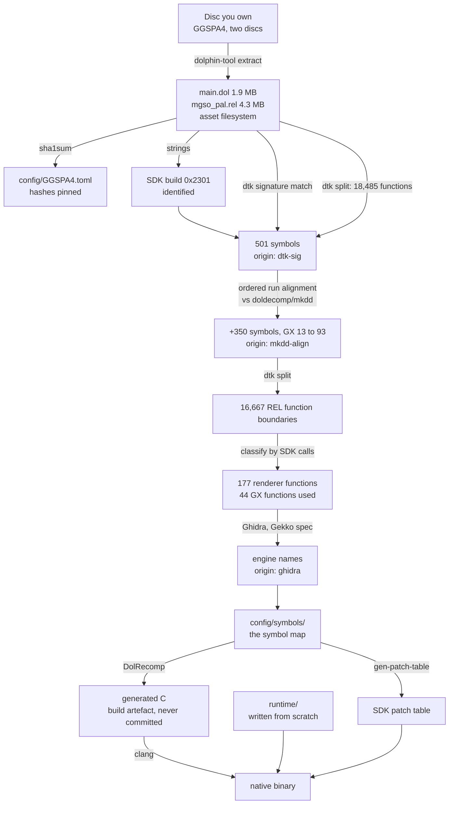

# The decompilation process, end to end

Every stage from a disc you own to a native binary: what goes in, what tool
runs, what comes out, and **how the output is verified**.

This document has two jobs. The first is reproducibility — anyone with the same
disc should reach the same symbol map. The second is **provenance**: `README.md`
claims that everything in this repository was produced by our own analysis of a
legally owned copy, together with public clean-room decompilation projects. This
document is where that claim is made checkable, stage by stage.

**No stage takes input from leaked source code.** Project rule 9 is absolute,
and each stage below names its inputs explicitly so that a reader can confirm
it.

Stages marked **DONE** have been run against the target. Stages marked
**PLANNED** have not; their commands are the intent, not a record.



---

## Stage 1 — Extract the disc · **DONE**

**In:** the user's own disc images. **Out:** `discs/GGSPA4/disc{1,2}/`,
git-ignored.

```sh
tools/dolphin.sh tool extract -i "<disc1>.iso" -o discs/GGSPA4/disc1
tools/dolphin.sh tool extract -i "<disc2>.iso" -o discs/GGSPA4/disc2
```

Produces `sys/main.dol`, `sys/apploader.img`, `sys/fst.bin` and the asset
filesystem including `files/shared/mgso_pal.rel`.

**Verified:** both discs' executables are byte-identical by SHA-1 — `main.dol`,
the REL and the apploader. Only assets differ. The recompiler therefore runs
once, not once per disc.

**Provenance:** the user's own disc. Nothing from this stage is ever committed.

## Stage 2 — Hash and pin · **DONE**

**In:** the extracted executables. **Out:** [`config/GGSPA4.toml`](../config/GGSPA4.toml).

```sh
sha1sum discs/GGSPA4/disc1/sys/main.dol \
        discs/GGSPA4/disc1/files/shared/mgso_pal.rel
```

Hashes are taken of the **extracted executables**, not the disc image. That is
what the build checks, and it makes the check independent of the container
format — `.iso`, `.gcm`, `.rvz` and NKit all produce the same `main.dol`.

**Open:** the current dumps are NKit, so these hashes are not yet confirmed
against a redump-clean image. See HANDOFF F8.

## Stage 3 — Identify the SDK build · **DONE**

**In:** `main.dol`. **Out:** the build ID, recorded in `config/GGSPA4.toml`.

```sh
strings -n 6 discs/GGSPA4/disc1/sys/main.dol | grep "Dolphin SDK"
```

Nintendo's SDK libraries each embed a build string. All thirteen components are
present, newest 2003-08-06, all tagged **`0x2301`**.

**Why this stage exists at all:** the build ID is what makes stage 4 possible.
Without it there is no way to know which other games' decompilations share this
exact SDK, and symbol recovery would be pure manual analysis of 380 KB.

**Provenance:** strings in the user's own binary.

## Stage 4 — Signature-match the SDK · **DONE**

**In:** `main.dol` + `decomp-toolkit`'s signature database.
**Out:** 501 symbols in
[`config/symbols/main.dol.symbols.txt`](../config/symbols/main.dol.symbols.txt),
origin `dtk-sig`.

```sh
extern/decomp-toolkit/target/release/dtk dol info \
    discs/GGSPA4/disc1/sys/main.dol
```

`dtk` compares byte patterns in our binary against signatures derived from
public decompilation projects. A match names the function.

**Recovered:** OS 87, Metrowerks TRK debugger 79, CodeWarrior runtime 78, DVD
21, PPC 20, GX 17, EXI 13, SI 7.

**Provenance:** names come from public clean-room decompilation projects, which
recover the SDK's API by analysing retail binaries. Names, not code.

## Stage 5 — Close the GX gap by run alignment · **DONE**

**In:** our function boundaries + `doldecomp/mkdd`'s symbol map.
**Out:** 350 further symbols, origin `mkdd-align`.

Mario Kart Double Dash links **the same SDK `0x2301` build**, and its decomp
publishes a symbol map with addresses and sizes.

**Established before relying on it:** of 287 symbols named in both, **264 have
byte-identical sizes (92%)**. Every mismatch is a C-runtime function whose
codegen varies with compiler options, not an SDK function.

**Why it is not a constant offset.** Each game links only the SDK functions it
references, so the offset is *piecewise* constant: `GXInit` through
`GXSetGPFifo` — five consecutive functions — all sit at exactly `-0x82098`,
then it shifts as functions absent from one binary drop out.

```sh
tools/align-symbols.py \
    --ours build/phase0/main.symbols.txt \
    --ref  extern/mkdd/config/MarioClub_us/symbols.txt \
    --out  build/phase0/aligned.txt
```

The tool runs two independent passes, and a name is only ever written onto an
unnamed `fn_*` function whose size matches exactly:

1. **Between-anchor segments.** Two consecutive anchors bracket a segment in
   each binary. If the segments are the same length *and* every size agrees
   pairwise, the linker kept the same functions in the same order between those
   points, and the mapping is 1:1.
2. **Gap resync.** A run ends at a size mismatch because one binary links a
   function the other does not. Rather than stopping, look ahead a bounded
   distance in each list for a point where the next **3 consecutive sizes all
   agree**, and resume there. The window guard is what makes this safe: a lone
   size coincidence is common — many functions are 0x20 bytes — but three in a
   row agreeing by chance is not.
3. **Run extension.** Walk outward from each anchor while sizes agree. This
   catches the regions beyond the first and last anchor.

A function claimed with two different names by different runs is dropped
rather than guessed at.

### Result, and the proof of it

```
ours              1804 functions in .text
reference        15342 functions in .text
anchors            264 (same name AND same size in both)
segments mapped     59 (consecutive anchors, exact size agreement)
gap resyncs       1275 (3 consecutive sizes must agree)
runs extended      479
names assigned     415
```

| | before | after |
|---|---|---|
| symbols in the map | 501 | **915** |
| GX functions named | 13 | **148** |
| SDK entry points the engine calls, named | 70 | **96** |

**Three independent checks, all passed:**

1. **The two passes agree.** Segment matching produced **no names that run
   extension had not already produced, and no contradictions**. Two different
   methods over the same data reaching the same answer is the strongest signal
   available here.
2. **Sizes match exactly**, by construction — a name is never transferred onto
   a function of a different size.
3. **Cross-checked against a second, unrelated source.** Of the 131 GX names
   this stage produced, **111 (85%) appear in `doldecomp/dolsdk2004`'s GX
   sources**, a decompilation of a *different* SDK release by a *different*
   project. Those that do not are internal `__GX*` statics, where decomp
   projects legitimately differ on naming — no public API function is
   unaccounted for.
4. **Gap resync raised precision rather than trading it away.** Before resync,
   82% of GX names were confirmed by `dolsdk2004`; after, **85%**. It also
   changed **no** previously-assigned name. A relaxation that increases
   agreement with an independent source is doing real work, not guessing.

**Remaining:** MKDD names 177 GX functions; we have 93. The rest were not
recovered because the surrounding runs broke on size disagreement, which
happens wherever the two games link different neighbouring functions. Closing
that needs the Dolphin SDK-call log (stage 9's harness, built early) or manual
analysis in Ghidra.

**Provenance:** a public clean-room decompilation of a different game. No code
is copied — only names, and only where our own binary's function sizes
independently confirm the match. `tools/align-symbols.py` is our own code and
is committed, so the derivation can be re-run and checked.

## Stage 6 — Recover the engine · **IN PROGRESS**

**In:** `mgso_pal.rel`, 4.3 MB. **Out:** function boundaries, then names.

### 6a. Function boundaries · **DONE**

```sh
dtk dol config -o build/phase0/config.yml \
    discs/GGSPA4/disc1/sys/main.dol \
    discs/GGSPA4/disc1/files/shared/mgso_pal.rel
dtk dol split build/phase0/config.yml build/phase0/out
```

**18,485 functions** — 1,818 in the DOL, **16,667 in the REL**.

### 6b. Naming: what does not work, and why · **DONE (negative result)**

**Signature matching cannot help and never will.** The REL is Konami's MGS2
engine as built for this game; it appears in no other binary, so there is
nothing to match against. `dtk` finds exactly three symbols in it — `_prolog`,
`_epilog`, `_unresolved`.

**Debug strings barely help either.** The engine does leave some assert strings
that name their own function (`... :: NewPutBreakObject`), but there are only
**about 25** of them and **8 source filenames**. Worth harvesting; not a
strategy. Recording this as a negative result so it is not re-attempted.

### 6c. Classify by SDK usage · **DONE**

What *does* scale: the REL calls into the DOL's SDK by cross-module relocation,
and the DOL is now 851 named symbols. A function that calls `GXSetTevOp` is
renderer code whatever it is called.

```sh
tools/classify-rel.py \
    --asm build/phase0/out/mgso_pal/asm/auto_00_00000000_text.s \
    --symbols config/symbols/main.dol.symbols.txt \
    --out build/phase0/rel-areas.txt
```

```
REL functions calling named SDK      221
distinct SDK functions called         80

engine functions by area:
  renderer         177
  os/threads        32
  file i/o           6
  input              3
  video              3
```

This assigns **no names** — it is a map of where to look, which is the
expensive part of reading 16,667 functions.

### 6d. The GX surface, and what it implies · **DONE**

The same pass answers a question phase 3 depends on: **which GX functions does
this game actually call?** [`config/gx-surface-used.txt`](../config/gx-surface-used.txt)
is the answer — **44 functions**, against the SDK's ~200. That is the renderer's
scope.

**It also confirms the design document's biggest phase-3 risk is real.** The
document lists indirect texturing among the GX edge cases that "take far longer
than planned". The game calls `GXSetTevIndirect`, `GXSetIndTexMtx`,
`GXSetIndTexOrder`, `GXSetIndTexCoordScale` and `GXSetNumIndStages` — **indirect
texturing is used, not hypothetical**. Fourteen `GXSetTev*` calls indicate the
TEV configuration space is used broadly, including `GXSetTevSwapModeTable`,
`GXSetTevKColor` and `GXSetTevColorS10`.

**Known incompleteness:** this covers direct calls only. `GXCallDisplayList` and
raw FIFO writes bypass the API, so the FIFO command parser is still required.
The Dolphin SDK-call log (stage 9's harness) will confirm the remainder.

### 6e. Ghidra cross-check and audit trail · **DONE**

An independent analyser, run for two reasons: to check stage 4 and 5's results
against something that shares no code with `dtk`, and to leave an auditable
record of the analysis.

```sh
tools/ghidra-analyse.sh discs/GGSPA4/disc1/sys/main.dol main_dol
```

Output lands in [`docs/evidence/`](evidence/): a function inventory, the full
analysis log, and a SHA-256 of both plus the input binary, so anyone can re-run
this and compare.

**`-loader-autoloadMaps false` is required, not cosmetic.** With map autoloading
on, the GameCube loader pops a GUI "load a symbol map?" dialog during import,
which throws in headless mode and fails the run outright.

**The cross-check:**

| | |
|---|---|
| | Ghidra | `dtk` | agreement |
|---|---|---|---|
| `main.dol` functions | 1,687 | 1,818 | **92.8%** |
| `mgso_pal.rel` functions | 16,323 | 16,667 | **97.9%** |

The REL agreement matters most: that is 4.3 MB of code with no symbols, no
signatures and no prior art, and two analysers sharing no code independently
resolve it to within 2%.

| | |
|---|---|
| symbols we had named | 773 |
| confirmed by Ghidra at the same address | **606 (78.4%)** |
| not confirmed | 167 — all **data** symbols (`__GXData`, `__PADSpec`, `__DVDVersion`), correctly not functions |

So every named symbol Ghidra classifies as a function agrees with ours, and the
disagreements are entirely the expected code/data split. Two analysers sharing
no code reaching the same answer is the point.

### What `docs/evidence/` contains, and what it does not

**It contains facts:** addresses, sizes, names, incoming-call counts. The same
class of information as a symbol map — which is what every decompilation
project publishes, `doldecomp/mkdd`'s `symbols.txt` included, the file stage 5
depends on.

**It does not contain decompiled source.** Ghidra's pseudo-C is a reconstruction
of the game's own code — a translation, and so a derivative work. Project rule 8
keeps it out, `README.md` states publicly that no game code is here, and the
same reasoning already excludes DolRecomp's generated C at stage 7. The
distinction is not where the data came from — all of it comes from analysing the
game — but whether it is **fact or expression**.

**The audit trail without the distribution:** the Ghidra project and any
decompiler output stay under `build/`, which is git-ignored. The committed
SHA-256 is what makes the run checkable — re-run the command and the hashes
either match or they do not.

### 6f. Next: name the entry points the engine actually uses · **PLANNED**

Of **336 DOL functions called directly from the REL**, 70 are named and **266
are not**. Those 266 are the highest-value naming targets in the project: each
is an SDK entry point the engine demonstrably uses. Routes are the Dolphin
SDK-call log and Ghidra:

```sh
tools/ghidra.sh <project-dir> twinsnakes \
    -import discs/GGSPA4/disc1/files/shared/mgso_pal.rel \
    -processor "PowerPC:BE:32:Gekko_Broadway"
```

Use `PowerPC:BE:32:Gekko_Broadway`, not `PowerPC:BE:32:default` — the stock
variant mis-decodes the paired-single instructions.

**Provenance:** our own analysis, with our own tools, of the user's own binary.
`tools/classify-rel.py` is committed so every claim here can be re-derived.

## Stage 7 — Translate to C · **PLANNED**

**In:** `main.dol`, `mgso_pal.rel`, the symbol map. **Out:** `build/generated/`,
git-ignored.

```sh
cmake --build build    # runs DolRecomp as a build step
```

DolRecomp translates each function to `void fn_80xxxxxx(PPCContext*, uint8_t*)`.
SDK symbols are **not** translated: they are routed to the patch table and
replaced by the native runtime.

The generated C is a **build artefact**. It is never hand-edited and never
committed — it is regenerated from the user's own disc on every build, which is
also why no game code enters this repository.

## Stage 8 — Compile and link · **PLANNED**

**In:** generated C + `runtime/` + `patches/`. **Out:** the native binary.

The runtime is **written from scratch** for this project. Where it reuses code,
that code is from Dolphin under GPL, recorded in `THIRD_PARTY.md` with its
source commit — which is why the port is GPL-3.

Compile with `-O2`, not `-O3`, and **never `-ffast-math`**: paired-single
semantics need exact rounding.

## Stage 9 — Verify against the original · **PLANNED**

**In:** the port and Dolphin. **Out:** a divergence report.

Because the game's logic is unchanged, any divergence from Dolphin localises to
a shim rather than to the game. Record an input sequence in Dolphin, replay it
in the port, and compare guest-memory checksums at fixed frames; diff `OSReport`
output between the two.

This harness is built in phase 1 and used for the rest of the project.

---

## Provenance ledger

Every symbol in `config/symbols/` carries an origin column. The permitted values
are exactly:

| Origin | Meaning |
|---|---|
| `dtk-sig` | signature match against the SDK `0x2301` build |
| `mkdd-align` | ordered run alignment against `doldecomp/mkdd` |
| `sdk2004` | name confirmed against `doldecomp/dolsdk2004` sources |
| `ghidra` | recovered by our own analysis |
| `own` | named by our own reasoning about behaviour |

**There is no origin for leaked source, and there will not be one.** If a symbol
cannot be given one of the origins above, it does not go in the map.
