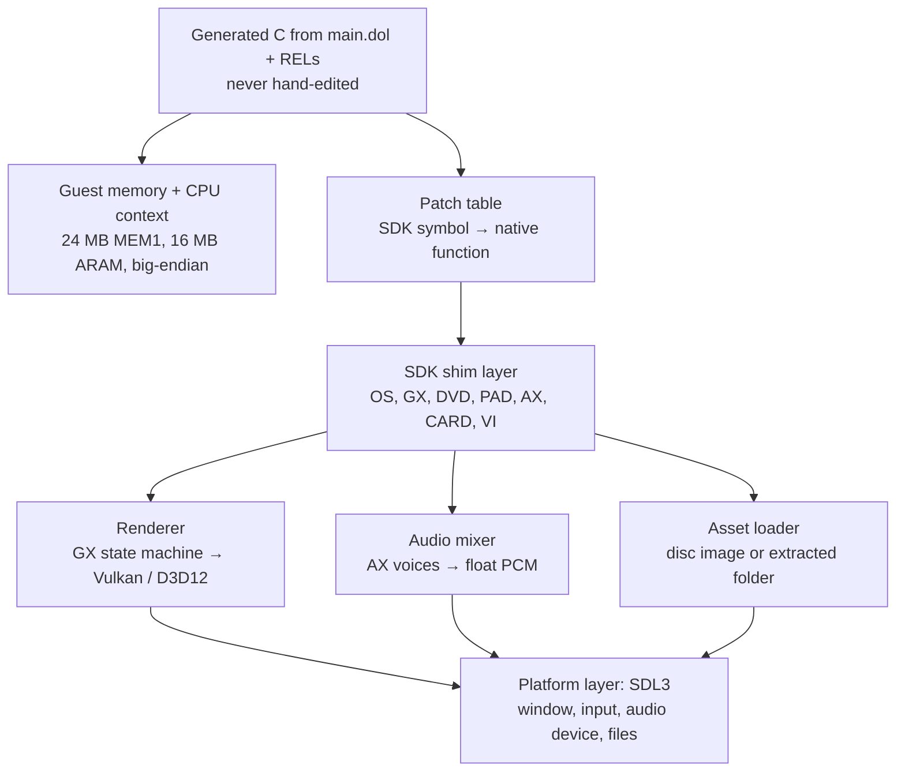
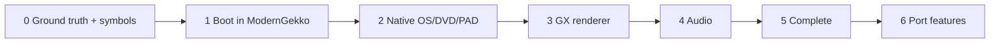

# Twin Snakes Native Port — Design Document

2026-09-17

## Overview

The project is a **static recompilation** of Metal Gear Solid: The Twin Snakes (GameCube, 2004; PAL build GGSPA4) into native Windows and Linux builds. The game's PowerPC code is translated ahead of time into C, compiled with a normal host compiler, and linked against a runtime that reimplements the GameCube SDK on SDL3 and Vulkan. At runtime there is no PowerPC, no interpreter and no JIT; the game's own logic runs as native machine code, so behaviour, saves and physics match the original disc exactly.

Matching decompilation is out of scope. The generated C is a build artefact, never hand-edited, and readability is not a goal; a hand-written replacement is only ever introduced for a specific function when a port feature (widescreen, a bug fix) needs it.

Why this is the right shape for Twin Snakes specifically:

- Twin Snakes has no public decompilation, so a matching decomp would start from zero symbols and take years. Static recompilation needs function boundaries and SDK symbols only, which can be recovered from the DOL in weeks. (Confirmed in practice: the SDK build was identified within minutes of the first extraction.)
- The Gekko is an in-order 32-bit PowerPC with no self-modifying code in retail titles, the ideal input for static translation, and [DolRecomp](https://github.com/ExpansionPak/DolRecomp) already handles it.
- **The engine is Konami's MGS2 engine, not Silicon Knights' own** (corrected 2026-09-18 — the REL carries `MGS2MAIN`, `libgv_cnf.c`, `.kms` model references and `data.cnf` lookups). Silicon Knights built the game on Konami's technology rather than the Eternal Darkness engine. This is *better* for the port than the original assumption: MGS2's `libgv` and the `.kms` model format are documented by the MGS modding community, so the asset side has prior art. The SDK-boundary argument is unaffected — it sits on the standard Nintendo SDK either way.

The finished port has three parts: generated code from both discs' executables, a runtime library that implements the GameCube SDK natively, and a loader that reads assets from the user's own disc images.

## Target game: Metal Gear Solid: The Twin Snakes

**The bring-up target is the PAL release, disc ID GGSPA4** (retargeted 2026-09-18 from the North American GGSEA4: PAL is the dump that exists). Both discs share the ID; the disc number field at offset 0x06 of `boot.bin` distinguishes them, confirmed as 0x00 and 0x01. Every address, symbol and hash in the project is tied to this build; US (GGSEA4) and Japanese (GGSJA4) support are a later addition once PAL is complete.

PAL brings one complication the US build would not have: 50 Hz and 576i are the native display modes, which interacts with the frame-rate question below and with any phase-6 widescreen work. Check whether the game offers a 60 Hz mode at boot before assuming the 50 Hz timing is what the logic runs on.

What is known and what phase 0 must establish:

| Property | Known | To verify in phase 0 |
| --- | --- | --- |
| Developer / engine | Silicon Knights, building on **Konami's MGS2 engine** (`libgv`, `.kms` models, `data.cnf`); published by Konami, 2004 | **Answered: the SDK is used directly and lives entirely in `main.dol`** — the REL contains no SDK copy and calls in by relocation |
| Discs | Two discs; the game prompts for a swap mid-story | Which SDK disc-change path it uses (`DVDGetCurrentDiskID`, cover-status polling) so the runtime can present disc 2 without a physical swap |
| Decomp status | No public decompilation or symbol map exists | Function boundaries and SDK symbols must be recovered by signature matching against known SDK builds (Ghidra with the Gekko spec plus dtk's analyser) |
| **SDK build** | **Answered: Dolphin SDK `0x2301`**, newest component 2003-08-06, Metrowerks CodeWarrior. Components AI, AR, ARQ, AX, CARD, DSP, DVD, EXI, GX, OS, PAD, SI, VI | Done — this is the key for signature matching |
| **Code layout** | **Answered: DOL plus one large REL.** `main.dol` is 1.9 MB; `files/shared/mgso_pal.rel` is **5.7 MB**, so most of the game's code is in the overlay. The engine has its own `rel_loader.c` | Function count; whether `rel_loader.c` wraps `OSLink` or replaces it |
| **Both discs' executables** | **Answered: byte-identical.** `main.dol`, the REL and the apploader have the same SHA-1 on both discs; only the asset filesystem differs | Done |

| Audio | Voice-over and music streamed from disc; Dolby Pro Logic II output | **Answered: stock AX, no custom microcode** — the SDK's own AX build string is present. **The stream codec is Ogg Vorbis (Tremor), not DSP-ADPCM**: `floor0.c`, `floor1.c`, `codebook.c`, `mapping0.c`, `res012.c`, `sharedbook.c`, `framing.c` are all in the DOL, alongside the engine's `sd_ogg.c`, `sd_stream2.c`, `sd_sound.c` |
| Video | Cutscenes are real-time in-engine | **Answered: there is also 95 MB of MPEG video** in `files/shared/movie.dat` (pack, sequence and GOP start codes present), decoded by the game's own `mpegGCN.c`. Not Bink, not THP. The runtime needs an MPEG decoder and a presentation path |
| Memory card | Psycho Mantis reads other games' save files (Eternal Darkness, Wind Waker, Sunshine, Melee) | CARD enumeration API surface used; the runtime must expose a directory of save files, not just the game's own |
| Frame rate | 30 fps, 480p and progressive-scan supported | Whether game logic is frame-locked at 30 |

The absence of a decomp is the main cost of this choice. Budget the first 2–4 weeks purely for symbol recovery: identify the SDK by string, match its \~400 public functions by byte signature (the same SDK build appears in many other games whose decomps *do* name them), and map the remaining engine functions by address only. The recompiler needs nothing more than that to produce correct code.

The two-disc structure is the other Twin Snakes-specific design point, and it is **simpler than it first appeared**: the two discs carry byte-identical executables, so the recompiler runs once and the disc swap is purely a DVD/asset concern. The runtime should mount both disc images at startup and present a virtual disc-swap: when the game polls for disc 2, the DVD shim reports the cover opened, disc 2 inserted, and cover closed, on the timing the SDK expects.

## Toolchain and existing projects to build on

Start from [DolRecomp](https://github.com/ExpansionPak/DolRecomp) for the CPU side and write your own native runtime; do not start from a Dolphin-derived runtime if the goal is a true native port. As of September 2026 no GameCube recomp is fully playable, and the two tracks in the field make the trade-off clear:

| Project | Runtime | Status | Lesson |
| --- | --- | --- | --- |
| [DolRecomp + ModernGekko-Template](https://github.com/ExpansionPak/ModernGekko-Template) | Dolphin-derived core for video, audio and HLE | Luigi's Mansion reaches its title screen; LLVM object backend available | Fastest bring-up; DolRecomp is CPU-only and emits split C or LLVM objects, so its output is reusable under your own runtime |
| [RingOut (SoulCalibur II)](https://github.com/jackpoison-prog/RingOut) / [RecompCore](https://github.com/aharonahdoot/RecompCore) | Dolphin fork with a static-recomp CPU core and interpreter fallback | Runs; Steam Deck packaging | Interpreter fallback for uncovered code is the pragmatic answer to indirect branches and REL overlays |
| [sp00nznet/ww (Wind Waker)](https://github.com/sp00nznet/ww) | Fully native: own recompiler, GX to Direct3D 11, TEV to HLSL, J3D parsing from the disc | Renders real geometry at 60 fps but stuck at the title screen (archive mounting) | This is the shape of a true native port. Windows-only D3D11 is why it is not your template |
| [Wiicompiled (Mario Kart Wii)](https://nio03.github.io/unricopie/en/recomp/mario-kart-wii) | Native, no PowerPC at runtime | Beta, most-starred PowerPC-native recomp | Wii Broadway is the same ISA as Gekko; its SDK-replacement approach carries over directly |
| [XenonRecomp / UnleashedRecomp](https://github.com/hedge-dev/UnleashedRecomp) | Native, Win/Linux, D3D12 and Vulkan | Fully playable | The reference architecture: recompiled code, a kernel/SDK shim layer, a native renderer, a launcher. Copy its structure |

Tools by stage:

| Stage | Tool | Role |
| --- | --- | --- |
| Disc extraction | Dolphin (Properties → Filesystem → Extract), or DolRecomp's built-in extractor (`.iso` only) | `sys/main.dol` from both discs, any `.rel` files, the asset filesystem |
| Symbols and analysis | Ghidra with the Gekko/Broadway processor spec; decomp-toolkit (`dtk`) for function-boundary analysis; SDK signature files derived from other games' decomps on decomp.dev | Function boundaries, SDK function names, jump tables, data vs code. Twin Snakes has no decomp, so this is built from scratch |
| Decompiling for understanding | Ghidra's decompiler view on the same project, with the paired-single and `OSReport` format strings as anchors | Reading engine functions in pseudo-C when writing a patch or diagnosing a shim bug. Output is for humans only; it is never compiled into the port |
| PowerPC to C | DolRecomp (C11 or LLVM 19/20 objects) | Generated code; treat as a build artefact, never edit |
| Native runtime | Your own C++20 library (see next sections) | SDK reimplementation |
| Platform layer | SDL3 | Window, input, audio device, gamepad, filesystem |
| Graphics | Vulkan with a D3D12 backend later, or SDL3 GPU if you want one code path | GX translation target |
| Build | CMake + Ninja, vcpkg or system packages on Linux | One tree, both platforms |
| Reference | Dolphin source (GPL) for exact hardware semantics; libogc headers for the public GX/OS API shapes | Read for behaviour, do not copy code unless you accept GPL for the whole port |

### Where Ghidra's decompiler earns its place

"Matching decompilation is out of scope" is a statement about the *whole binary*
— recovering C that recompiles byte-exactly, for every function, is what would
take years. It is not a statement about reading code. Targeted decompilation of
individual functions in Ghidra is cheap, and it should be used freely wherever
it removes guesswork. Four places pay for themselves:

1. **Phase 0, the functions signature matching misses.** A byte signature only
   finds an SDK function if the same build appears in a decomp we have. For the
   rest, read the pseudo-C and recognise the function by what it does — an
   allocator, a list insert, a DMA kick. This is also how code is told from
   data, and how jump tables are resolved into the entries the function table
   needs.
2. **Phases 2–4, diagnosing a shim.** Because the game's logic is unchanged,
   every divergence from Dolphin localises to a shim — but localising it to a
   shim is not the same as knowing what the game expected. When the port
   diverges at a fixed frame, decompile the *caller* and read what it does with
   the return value. That is usually faster than instrumenting the shim.
3. **Phase 6, port features.** A `patches/` replacement cannot be written
   without understanding the function it replaces. Widening the culling frustum
   for widescreen starts in the decompiler view, not in the generated C.
4. **Custom DSP microcode**, if phase 0 finds any. There is no signature
   database for a game-specific ucode; reading it is the only route.

Anchors that make the pseudo-C readable: `OSReport` format strings name their
own functions, the paired-single instructions mark out the maths, and every
identified SDK call site labels its caller by what it is doing.

Its limits are worth knowing before relying on it. Paired-single and other
Gekko-specific instructions decompile poorly or not at all, so the maths is
usually clearer in the disassembly. Ghidra recovers no struct layouts on its
own — those are inferred by hand from access patterns, and once inferred they
are *our* naming and belong in `config/symbols/` where the next person gets
them for free.

**The discipline is unchanged: the decompiler's output is for humans.** It is
never compiled into the port, and it is never committed — it is derived
directly from the game's code, which rule 8 keeps out of the repository. A
`patches/` replacement written *from* that understanding is our own code and is
committed; the pseudo-C it was read from is not, and neither are notes that
quote it. Record what a function *does*, not what Ghidra printed.

The DolRecomp discord and the [Recompendium catalog](https://nio03.github.io/unricopie/en/) are where the active GameCube work is coordinated; check both before building anything the ww or Wiicompiled authors have already solved.

## Architecture

The port is four layers. Generated game code sits on top of a guest memory model, calls into an SDK shim layer through a patch table, and the shim layer calls a platform layer that is the only code that knows about the host OS.



The generated code layer is the whole game translated mechanically: every function becomes `void fn_80xxxxxx(PPCContext* ctx, uint8_t* mem)`. Indirect calls go through a function table keyed by guest address, which is also how REL overlays and the patch table plug in.

**The translated/native boundary falls almost exactly on the file boundary.**
This was measured in phase 0 and it is the most useful structural fact about the
game:

| | `.text` | Share of all code | Contents |
| --- | --- | --- | --- |
| `main.dol` | 380 KB | **7.9%** | Nintendo SDK, CodeWarrior runtime, Metrowerks TRK debugger. Almost no game code |
| `mgso_pal.rel` | 4.3 MB | **92.1%** | The entire game engine. No SDK copy — it calls into the DOL by relocation |

So the DOL is very nearly *the thing being replaced* and the REL is very nearly
*the thing being translated*. The patch table maps DOL addresses to native
implementations; DolRecomp's real work is the REL. This is a far cleaner split
than the design assumed, and it means the 400-function SDK surface is a
self-contained 380 KB rather than something tangled through the game.

**Guest memory model.** Allocate one 24 MB block for MEM1 at a fixed host address and keep every guest pointer as a 32-bit offset into it. All loads and stores byte-swap, because the Gekko is big-endian and both targets are little-endian. Structures the SDK shims read from guest memory (GX display lists, OS threads, file info blocks) are read through explicit swap accessors, never cast.

**Patch table.** For each SDK function in the symbol map, the recompiler emits a call to the native implementation instead of translating the original body. The game sees identical behaviour; you get to write `GXBegin` in C++ once rather than emulate the write-gather pipe. This is the single most important design decision: the boundary between "translated" and "native" is the SDK's public API, which is documented, stable across games, and around 400 functions.

**Amended 2026-09-19: the boundary is the SDK's public API *plus the
CodeWarrior runtime's block moves*.** `memcpy`, `memset` and `__fill_mem` are
not SDK — they are Metrowerks Standard Library, linked into `.init` — and by
the rule above they should stay translated. Measurement says otherwise:
a sampling profile of the boot puts **62.8% of the run inside `memcpy` and
23.5% inside `__fill_mem`**, and there are only nineteen `memcpy` calls in the
whole boot, one of which moves 5.7 MB. Translated, that is a two-instruction
byte loop run 5.7 million times, every store landing in the second address
window and taking the slow external-write path out to the host.

The principle behind the original rule is unchanged — the boundary belongs
where the interface is documented, stable and narrow — and these three qualify
on all three counts; they are simply from a different library than anticipated.
What the rule was protecting against is *engine* code creeping across the
boundary, and that prohibition stands unaltered. See
`runtime/os/mem_shims.c`, and note that the guest's `memcpy` has **memmove**
semantics: it compares source against destination and copies backwards when
they overlap, so the shim must too.

**Threads.** GameCube OS threads are cooperative on a single core with priority scheduling. Implement `OSThread` on a fiber or ucontext scheduler that runs exactly one guest thread at a time, so the game's own assumptions about atomicity hold. Host threads are used only inside the platform layer (audio callback, file prefetch, GPU submission).

**Renderer.** Keep the GX state machine (TEV stages, vertex descriptors, matrix memory, texture cache) as a faithful software model, and emit host draw calls from it. Shaders are generated from TEV configuration and cached by hash, as Dolphin and the ww project both do. Rendering at native GameCube resolution with a scale factor is the first milestone; widescreen and higher-quality upscaling are later.

**Determinism.** The game's logic is unchanged, so save data, RNG and physics match the original disc exactly. Treat any divergence from Dolphin's behaviour as a bug in the shim layer.

## Replacing the GameCube SDK

The SDK shim layer is where most engineering hours go. Order the work by what blocks boot: OS and DVD first, then GX, then PAD, with audio last because the game runs silently without it.

| SDK library | What the game calls | Native replacement | Difficulty |
| --- | --- | --- | --- |
| OS | `OSInit`, `OSAlloc`/arenas, `OSCreateThread`, `OSSleepThread`, mutexes, alarms, `OSGetTime`, interrupt handlers, `OSReport`, `OSLink` for RELs | Fiber scheduler, arena over guest memory, monotonic clock scaled to 40.5 MHz timebase, alarms driven from the frame loop, REL loader with relocation | High: threading semantics must be exact |
| DVD | `DVDOpen`, `DVDReadAsync`, `DVDGetCommandBlockStatus`, FST lookup by path | Read from the user's disc image (`.iso`/`.gcm`, or RVZ via a small decoder) or an extracted folder; complete reads on a worker thread and fire callbacks on the guest thread | Low |
| GX | \~200 functions: `GXSetVtxDesc`, `GXLoadPosMtxImm`, `GXSetTevOp`, `GXBegin`/write-gather immediate mode, display lists via `GXCallDisplayList`, `GXCopyDisp`, `GXSetZMode`, texture and TLUT loading | GX state model, FIFO command parser (games write raw FIFO commands too), TEV-to-GLSL/HLSL shader generator, texture decoder for I4/I8/IA4/IA8/RGB565/RGB5A3/RGBA8/CMPR, EFB copy emulation | Very high: this is the port |
| VI | `VIConfigure`, `VIFlush`, `VIWaitForRetrace`, XFB address | Present the last EFB copy; drive the frame loop from vsync or a timer | Low |
| PAD | `PADInit`, `PADRead`, `PADClamp`, rumble | SDL3 gamepad; map GC layout, handle the GC's analog trigger and C-stick semantics | Low |
| AX / DSP | `AXInit`, `AXAcquireVoice`, `AXSetVoice*`, `AXRegisterCallback` at 5 ms; DSP ARAM DMA | Native voice mixer: PCM decoder, per-voice SRC, mix at 32 kHz into SDL audio. **Vorbis streams decode with libvorbis/Tremor on the host** rather than needing a DSP-ADPCM decoder — the game already does this in software, so the translated code may simply run as-is | **Medium, and confirmed so**: stock AX, no custom ucode |
| ARAM / AR | `ARAlloc`, `ARStartDMA` | A second 16 MB host buffer; DMA is a memcpy with a completion callback | Low |
| CARD | Memory card open/read/write/create | Files in a per-user save directory; keep the 8 KB block format so saves stay compatible with Dolphin | Low |
| DSP init, EXI, SI | Low-level bus setup | Stubs that return success | Low |
| MTX / MTXVec, PSMTX | Paired-single matrix maths | Translated as ordinary code; optionally replaced with SSE/NEON versions for speed | Low |

Supported disc inputs (physical GameCube discs cannot be read by PC drives; users dump with CleanRip on a Wii):

- `.iso` / `.gcm`: raw dumps, \~1.4 GB per disc, mounted directly
- `.rvz`: Dolphin's compressed format, supported through a small built-in decoder
- `.nkit`: **normally refused** — not guaranteed byte-exact. The current dumps are NKit and are used knowingly: NKit rewrites junk and padding *between* files, not the files themselves, and the hash check is on the extracted executables rather than the image. Unverified against redump until someone with an untouched dump confirms the same `main.dol` SHA-1.
- Extracted folder: for development, assets editable in place

Twin Snakes needs both discs; the launcher asks for two images and hash-checks the executables extracted from them against `config/GGSPA4.toml`.

Two GX details decide whether the renderer is tractable:

1. **Vertex formats.** GX vertices are described by a per-attribute descriptor (direct vs 8-bit or 16-bit index) and format table (position as s8/s16/f32 with a fractional shift). Build one converter that turns any GX vertex stream into a fixed host layout, then the host renderer only ever sees one vertex format.
2. **TEV.** Up to 16 combiner stages with per-stage input selection, bias, scale and clamp, plus indirect texturing and alpha compare. Generate one fragment shader per unique TEV configuration; a full game produces a few hundred to a few thousand. Dolphin's `PixelShaderGen.cpp` is the definitive reference for the semantics, and the ww project has an HLSL version.

Everything above the SDK, meaning Silicon Knights' engine and the game itself, stays translated. Individual functions get hand-written replacements only when a port feature needs it, for example widening the culling frustum for widescreen.

## Build system and repository layout

One CMake tree builds both platforms; the recompiler runs as a build step on the user's own DOL, so the repository never contains game code. This is the pattern every shipped recomp uses and it is what keeps the project distributable.

```
recomp/
├── CMakeLists.txt
├── cmake/            toolchain files: msvc-x64, clang-linux, mingw cross
├── extern/           DolRecomp, SDL3, volk, VMA, spdlog (submodules or vcpkg)
├── config/
│   ├── GGSPA4.toml   per-game config: SDK build, hashes of main.dol and the REL
│   └── symbols/      symbols.txt and splits.txt recovered in phase 0
├── runtime/          the native SDK (no game knowledge)
│   ├── os/  dvd/  gx/  vi/  pad/  ax/  card/  aram/
│   ├── memory/       guest memory, byte-swap accessors, PPCContext
│   ├── gfx/          Vulkan backend, shader cache, texture decoder
│   └── platform/     SDL3 window, input, audio, paths
├── game/             game-specific glue: asset paths, REL list, hooks, enhancements
├── patches/          hand-written replacements for individual translated functions
├── tools/            extract-disc, verify-hash, gen-patch-table, shader-dump
└── build/            generated/  (recompiler output, gitignored)
```

Build flow, run by `cmake --build`:

1. `verify-hash` checks the user's extracted `main.dol` and `mgso_pal.rel` against the hashes in `config/GGSPA4.toml`; any other revision fails early. Hashing the extracted executables rather than the disc image makes the check independent of the container format.
2. DolRecomp emits split C (or LLVM objects) into `build/generated/`, with SDK symbols routed to the patch table instead of translated. **Both `main.dol` and the 5.7 MB REL go through it** — the overlay holds most of the game's code.
3. `gen-patch-table` produces the guest-address to native-function table from `symbols.txt` and the runtime's exported shims.
4. Normal compile and link: generated code, runtime, game glue, patches.

Platform decisions:

| Concern | Windows | Linux |
| --- | --- | --- |
| Compiler | Clang (clang-cl) preferred; MSVC works but is slower on the multi-MB generated files | Clang or GCC 13+ |
| Graphics | Vulkan first; D3D12 later only if driver problems surface | Vulkan |
| Packaging | Portable zip with a launcher that asks for the ISO | AppImage or Flatpak; Steam Deck is a first-class target given the ecosystem |
| CI | GitHub Actions matrix; the CI builds the runtime and tools only, never the game (no DOL available) | Same |

Compile-time notes: the generated C for a 3 MB DOL is 50–150 MB of source. Split it per function group so incremental builds stay under a minute, compile with `-O2` not `-O3`, and disable `-ffast-math` because paired-single semantics need exact rounding. Enable unity builds for the runtime only.

## Phased plan

Each phase ends at something you can run. Phase 0 through 2 are a few weeks each for one experienced developer; phase 3 is the long one.

| Phase | Goal | Exit criterion | Estimate |
| --- | --- | --- | --- |
| 0. Ground truth and symbols | Dump both discs, identify the SDK build from `main.dol` strings, signature-match SDK functions, run the game in Dolphin and log every SDK call for the first 60 s | A symbol map covering every SDK entry point the game calls, plus function boundaries for the engine code | 2–4 weeks |
| 1. Boot in ModernGekko | Run DolRecomp on both `main.dol` files; run under the ModernGekko/RecompCore template so Dolphin provides GX and audio | Title screen renders through recompiled CPU code with no interpreter fallback hits for the boot path | 1–2 weeks |
| 2. Native OS + DVD + PAD, headless | Replace the Dolphin runtime with your own for OS, DVD (including the virtual two-disc mount), VI stubs, PAD; GX calls log and discard | Game runs its main loop headless, reads assets, responds to input, `OSReport` output matches Dolphin's | 3–4 weeks |
| 3. GX renderer | Vertex converter, TEV shader generator, texture decoder, EFB copies, Vulkan backend | Title screen, the Dock and the Heliport render correctly at native resolution, compared frame-by-frame against Dolphin screenshots | 2–4 months |
| 4. Audio | AX voice mixer, ADPCM, disc streaming for voice-over and music | Music, codec calls and SFX match Dolphin output within tolerance | 3–6 weeks |
| 5. Saves and completeness | CARD emulation including the Psycho Mantis save-file scan, disc-2 swap, every SDK stub replaced with a real implementation, memory-leak and thread audit | Game completable start to finish on both platforms | 1–2 months |
| 6. Port features | Widescreen (needs game-side patches to culling and UI), 60 fps if logic is not frame-locked, resolution scaling, keyboard/mouse, launcher with ISO picker and hash check | Public release | Ongoing |

**The interim software rasteriser, and why it is not phase 3.** Phase 3 above
specifies a TEV-to-GLSL shader generator on a Vulkan backend, and that remains
the plan. But phases 1 and 2 need pixels on screen to be debuggable at all, so
`runtime/gx/raster.c` fills triangles on the CPU. It was fast enough for menus
and far too slow for the intro movie — 13.5 Mpx/s, about 320 cycles a pixel.

It now splits large triangles into bands of scanlines across the host worker
pool: 51.4 Mpx/s, a full boot in 10.6s against 40.3s. A band owns a disjoint
range of rows, so two bands cannot touch the same framebuffer or depth word;
no locking, no binning pass, and drawing order is preserved because each band
draws the same triangles in the same order. No arithmetic changes, which is
why the result is checkable: the framebuffer is bit-identical to the serial
path, and `MGS_RASTER_THREADS=1` is the control that demonstrates it.

This is recorded here because it is a real architectural commitment — the
rasteriser is now the second consumer of the worker pool described under
Architecture — and because it must not be mistaken for the phase 3 exit
criterion. A CPU rasteriser will not render the Dock and the Heliport at
native resolution. It buys time until the Vulkan backend exists, and the
phase 3 row is unchanged.



Phase 1 is deliberately a throwaway: running under the Dolphin-derived runtime first proves the recompiled CPU code is correct before you can blame your own SDK shims. Diff the two runtimes' `OSReport` logs and memory snapshots at fixed frame counts; that harness stays useful for the rest of the project.

Test strategy throughout: record input sequences in Dolphin, replay them in the port, and compare guest-memory checksums at fixed frames. Because the game logic is unchanged, any divergence localises to a shim.

## Risks, legal considerations and open questions

The biggest technical risk is the GX renderer; the biggest project risk is a takedown. Both are manageable if you follow the conventions the community has settled on.

| Risk | Likelihood | Mitigation |
| --- | --- | --- |
| GX edge cases (indirect texturing, EFB peek/poke, Z-textures, bump mapping) take far longer than planned | High | Phase 3 targets the first playable area only; keep a list of unsupported GX features and gate them by game screen |
| Indirect branches the recompiler cannot resolve (jump tables, virtual calls) | Medium | Function table keyed by address covers all of them; add an interpreter fallback (as RecompCore does) for anything missed, and log every hit so it can be fixed |
| Threading bugs from cooperative-to-host mismatch | Medium | Single guest thread at a time, always; no host thread ever touches guest memory except through queued events |
| Floating-point divergence from paired-single semantics | Medium | Exact rounding, no fast-math; unit-test the recompiler's PS instruction output against Dolphin's interpreter |
| Performance worse than Dolphin's JIT | Low | Static translation with LLVM is usually 2–4x faster than a JIT; profile before optimising |
| Legal takedown | Real, not hypothetical | See below |

**Legal.** I am not a lawyer; the following is how existing projects operate, not advice. Nintendo has pursued projects that distribute game code or assets; the recomps that have survived share these rules:

- The repository contains only your own code, the recompiler configuration and symbol names. No DOL, no generated C, no assets, no extracted textures, no screenshots with copyrighted art in the README if you want to be conservative.
- The user supplies their own disc image; the build hashes it and refuses anything else.
- Symbol names and struct layouts from a decomp project are the community's own naming and are considered fine; verbatim SDK source (leaked Dolphin SDK) must never be referenced or included. Use libogc's headers for API shapes, or write your own from the decomp's headers.
- If you copy from Dolphin the whole port becomes GPL-2.0-or-later. **This project has accepted that: the port is GPL-3.0** (see the settled question below), so Dolphin's texture decoder and `PixelShaderGen.cpp` are lifted directly, with the source commit recorded in `THIRD_PARTY.md`. The rule that remains is unchanged and is not about licences: no game code or assets, ever.
- Nintendo's position on this category is hostile; that is why a native runtime, not a Dolphin fork, is also the safer legal shape. A GitHub takedown of a Nintendo-title recomp is a plausible outcome regardless of how careful you are.

**Open questions to settle before phase 0:**

- [x] **Settled, 2026-09-18: GPL-3.0.** The port is GPL-3, and Dolphin's texture decoder and TEV shader generator are reused rather than reimplemented. This takes months off phase 3, the longest phase in the plan. It also makes RecompCore's interpreter fallback and ModernGekko's runtime liftable rather than reference-only, and it costs nothing that was wanted: DolRecomp is already GPL-3, and permissive redistribution was never a goal.
- [ ] Vulkan-only, or SDL3 GPU for one code path across Vulkan/D3D12/Metal at the cost of some GX features being harder to express?
- [ ] Is a Steam Deck build a launch target? It changes the packaging and controller work in phase 6.
- [ ] Do you want to contribute the runtime back as a shared GameCube runtime (the way N64ModernRuntime works for N64Recomp), or keep it Twin Snakes-specific? Shared is more work up front and more valuable.
- [ ] Is Konami's ownership of the Twin Snakes code (as opposed to Nintendo's of the SDK and platform) a factor in how public the project is? Konami has historically been quieter than Nintendo about fan projects, but this is a licensed title on Nintendo hardware.
